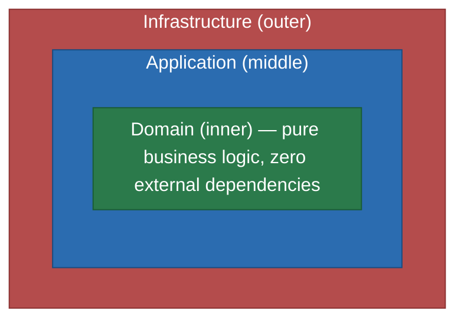
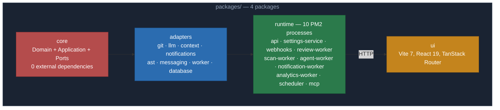

# Contributing to CodeNautic

Thank you for your interest in contributing to CodeNautic! This guide will help you get started with the development
environment, understand the architecture, and submit high-quality contributions.

---

## Table of Contents

- [Code of Conduct](#code-of-conduct)
- [Getting Started](#getting-started)
- [Architecture Overview](#architecture-overview)
- [Monorepo Structure](#monorepo-structure)
- [Development Workflow](#development-workflow)
- [Code Style](#code-style)
- [Testing](#testing)
- [Git Conventions](#git-conventions)
- [Pull Request Process](#pull-request-process)
- [Common Pitfalls](#common-pitfalls)
- [Getting Help](#getting-help)

---

## Code of Conduct

This project adheres to the [Contributor Covenant Code of Conduct](./CODE_OF_CONDUCT.md). By participating, you are
expected to uphold this code. Please report unacceptable behavior
to maintainers via private contact channels (for example, direct email listed on maintainer GitHub profiles).
For security vulnerabilities, follow the process in [SECURITY.md](./SECURITY.md).

---

## Getting Started

### Prerequisites

| Tool                                | Version |
|-------------------------------------|---------|
| [Bun](https://bun.sh/)              | >= 1.2  |
| [MongoDB](https://www.mongodb.com/) | >= 8.0  |
| [Redis](https://redis.io/)          | >= 7.4  |
| [Qdrant](https://qdrant.tech/)      | >= 1.13 |

### Setup

```bash
git clone https://github.com/samiyev/codenautic.git
cd codenautic
bun install
```

### Environment Variables

Copy the example files and fill in the required values:

```bash
cp packages/runtime/.env.example packages/runtime/.env
cp packages/ui/.env.example packages/ui/.env
```

### Verify Installation

```bash
cd packages/core && bun test          # Run core tests
cd packages/core && bun run lint      # Run linter
cd packages/core && bun run typecheck # Type checking
```

---

## Architecture Overview

CodeNautic follows **Clean Architecture + Hexagonal (Ports & Adapters) + DDD**. Understanding this is essential before
contributing.

### The Dependency Rule

Dependencies point **inward only** — never from inner layers to outer layers:



- **Domain** does NOT import Application or Infrastructure
- **Application** does NOT import Infrastructure
- All external dependencies are accessed through **ports** (interfaces in `application/ports/`)

### Key Concepts

| Concept         | Location                      | Rule                                                   |
|-----------------|-------------------------------|--------------------------------------------------------|
| Entity          | `domain/entities/`            | Identity via UniqueId, behavior required (no anemic!)  |
| Value Object    | `domain/value-objects/`       | Immutable, comparison by value, validation in factory  |
| Aggregate Root  | `domain/aggregates/`          | Extends Entity, emits domain events                    |
| Factory         | `domain/factories/`           | `IEntityFactory<T>` — every Entity/Aggregate needs one |
| Domain Event    | `domain/events/`              | Immutable, past tense (`ReviewCompleted`)              |
| Use Case        | `application/use-cases/`      | Orchestration only — no business logic                 |
| Port (inbound)  | `application/ports/inbound/`  | `IUseCase<In, Out, Err>` interfaces                    |
| Port (outbound) | `application/ports/outbound/` | `IRepository`, `IEventBus`, provider interfaces        |
| Domain Service  | `domain/services/`            | Business logic spanning multiple entities              |

### Critical Rules

- **Business logic belongs in the Domain layer only.** Use Cases orchestrate (fetch from port, pass to domain, save
  result) — they do NOT contain if/else business rules
- **No `new ConcreteClass()` inside Use Cases** — all dependencies via IoC
- **External types never penetrate the Domain** — each external system has its own Anti-Corruption Layer (ACL)

For full architecture details, see [PRODUCT.md](./PRODUCT.md).

---

## Monorepo Structure

> This diagram is conceptual and can be updated as implementation details evolve.



### Dependency Rules

- `core` depends on **nothing** — it is the innermost layer
- **All** other packages depend on `core`
- Provider packages (`git-providers`, `llm-providers`, etc.) do **NOT** depend on each other
- `api` is the **composition root** — it wires all providers via DI

### Adding a Dependency on Core

```bash
cd packages/<your-package>
bun add @codenautic/core
```

---

## Development Workflow

### TDD is Mandatory

We follow **Test-Driven Development** (Red → Green → Refactor):

1. Write a failing test
2. Write the minimum code to make it pass
3. Refactor while keeping tests green

No exceptions. Code without tests will not be accepted.

### Commands

All commands run from the **package directory**, not the monorepo root:

```bash
cd packages/<pkg> && bun test                        # Run tests
cd packages/<pkg> && bun test tests/file.test.ts     # Run single test file
cd packages/<pkg> && bun run lint                    # ESLint
cd packages/<pkg> && bun run format                  # Prettier (write)
cd packages/<pkg> && bun run format:check            # Prettier (check)
cd packages/<pkg> && bun run typecheck               # TypeScript type check
cd packages/<pkg> && bun run build                   # Build (tsc)
```

Or from the monorepo root using filters:

```bash
bun run --filter '@codenautic/<pkg>' test           # Run tests for one package
bun run --filter '*' lint                            # Lint all packages
```

> **Warning:** Running `bun test packages/ui/tests/file.test.tsx` from the root does **NOT** work with Bun workspaces.
> Always `cd` into the package directory first.

### UI Package (Special Case)

The `ui` package uses **Vitest** (not `bun test`):

```bash
cd packages/ui && bun run test                      # Vitest
cd packages/ui && npx vitest run tests/file.test.tsx # Single file
cd packages/ui && bun run dev                       # Vite dev server
```

---

## Code Style

### Formatting (Prettier)

- **Indentation:** 4 spaces
- **Line length:** max 100 characters
- **Quotes:** double (`"text"`)
- **Semicolons:** none
- **Trailing commas:** in multiline
- **Line endings:** LF

### TypeScript Rules

- `strict: true`, `noUncheckedIndexedAccess: true`
- **No `any`** — use `unknown` + type guards
- **No `enum`** — use `as const` or union types
- **No default exports**
- Always explicit return types
- `const` by default, `let` only when reassigning
- Only `===` and `!==`
- Curly braces always, even for single-line blocks
- Explicit access modifiers (`public`, `private`, `protected`, `readonly`) on all class members

### File Naming

- Files: `kebab-case.ts` (e.g., `review-issue.ts`)
- One class/interface per file

### Import Order

1. Node built-ins
2. External packages
3. `@codenautic/*` packages
4. Relative imports

Separate groups with a blank line.

### Naming Conventions

| What            | Convention  | Example                          |
|-----------------|-------------|----------------------------------|
| Interfaces      | `I` prefix  | `IGitProvider`, `IRepository`    |
| Value Objects   | PascalCase  | `FilePath`, `Severity`           |
| Entities        | PascalCase  | `Review`, `ReviewIssue`          |
| Use Cases       | +`UseCase`  | `ReviewMergeRequestUseCase`      |
| Services        | +`Service`  | `ReviewService`                  |
| Factories       | +`Factory`  | `GitProviderFactory`             |
| Domain Events   | Past tense  | `ReviewCompleted`, `IssueFound`  |
| Constants       | UPPER_SNAKE | `MAX_RETRIES`                    |
| Variables/funcs | camelCase   | `reviewResult`, `calculateScore` |

### JSDoc (Required)

Every function, class, method, and interface must have JSDoc documentation. Always use multi-line format:

```typescript
/**
 * Calculates the risk score for a given review.
 *
 * @param review - The review aggregate to analyze
 * @returns Risk score between 0 and 100
 */
public calculateRiskScore(review: Review): number {
    // ...
}
```

Single-line `//` comments are **not allowed**. Always use `/** */`.

### Error Handling

- Use `Result<T, E>` from `@codenautic/core` for expected errors
- `throw` only for programmer errors (bugs, impossible states)
- Domain errors extend `DomainError` with a unique `code`
- Empty `catch` blocks are **forbidden**

---

## Testing

### Framework

| Package    | Test Runner | Environment |
|------------|-------------|-------------|
| `ui`       | Vitest      | happy-dom   |
| All others | `bun test`  | Bun runtime |

### Coverage Requirements

- **99%** line coverage, **99%** function coverage per package
- Coverage that drops below the threshold is a release blocker

### Test Naming

Use `when/then` style:

```typescript
describe("Severity", () => {
    describe("create", () => {
        it("when value is CRITICAL, then creates Severity with correct level", () => {
            // ...
        })

        it("when value is invalid, then returns failure result", () => {
            // ...
        })
    })
})
```

### Mocking

**Bun packages** (everything except `ui`):

```typescript
import { describe, it, expect, beforeEach } from "bun:test"

describe("ReviewService", () => {
    let service: ReviewService
    let mockGitProvider: IGitProvider

    beforeEach(() => {
        mockGitProvider = createMockGitProvider()
        service = new ReviewService(mockGitProvider)
    })

    it("when review has critical issues, then blocks merge", async () => {
        const result = await service.review(mockMergeRequest)
        expect(result.issues).toHaveLength(2)
    })
})
```

**UI package** (Vitest):

```typescript
import { describe, it, expect, vi } from "vitest"

vi.mock("@/lib/api", () => ({
    fetchReviews: vi.fn(),
}))
```

---

## Git Conventions

### Branch Naming

`<package>/<description>` in kebab-case:

```
core/review-service
runtime/auth-middleware
ui/issues-table
adapters/rate-limiting
```

### Commit Messages

[Conventional Commits](https://www.conventionalcommits.org/): `<type>(<scope>): <subject>`

```
feat(core): add review service wiring for pipeline orchestration and deterministic result handling across use case boundaries
fix(git-providers): handle api rate limiting with retry backoff strategy and explicit error mapping for stable adapter behavior
test(core): add unit tests for severity value object validation and deterministic comparison across edge case inputs
refactor(ast): simplify dependency graph traversal while preserving graph construction contracts and improving execution trace clarity
chore(repo): update workspace lint setup to enforce stable commit workflow consistency across all package boundaries
```

**Rules:**

- Imperative mood, lowercase, header length at least 80 characters
- **Types:** `feat`, `fix`, `docs`, `style`, `refactor`, `perf`, `test`, `chore`
- **Scope:** package name (omit for root changes)
- Commit message language is **English only** (no Cyrillic characters in header or body)
- One commit = one logical change (atomic commits)
- Commit body is required and must contain at least 20 words with clear context
- Do **NOT** add AI attribution or `Co-Authored-By` lines
- Enforcement is automatic via `.githooks/commit-msg` and CI `Commit Policy` job

### GitHub Push Blocking

To block non-compliant commits in every branch, enable GitHub rulesets for all branches:

1. Create a ruleset with target pattern `**` and disable direct pushes
2. Require pull request before merge
3. Require status checks to pass:
   - `Policy Guard`
   - `Commit Policy`
   - `Verify Commit Email`
   - `Lint`
   - `Type Check`
   - `Test`
   - `Format Check`
4. Enable strict mode for required checks
5. Disable bypass for administrators (if strict governance is required)
6. Set repository variable `POLICY_MAINTAINERS` (comma-separated GitHub usernames) for allowed policy-file maintainers

Protected policy paths:

- `.github/workflows/**`
- `.githooks/**`
- `scripts/git/**`

### TDD Commit Order

For feature work, follow this commit sequence:

1. Types/interfaces
2. Tests → implementation
3. Refactoring (tests stay green)
4. Exports (`index.ts`)
5. Documentation, version bump

---

## Pull Request Process

### Before Submitting

1. **All tests pass:** `cd packages/<pkg> && bun test` (для `ui`: `cd packages/ui && bun run test`)
2. **Linter clean:** `cd packages/<pkg> && bun run lint` — zero errors, zero warnings
3. **Formatter clean:** `cd packages/<pkg> && bun run format:check`
4. **Type check passes:** `cd packages/<pkg> && bun run typecheck`
5. **No dead code:** remove unused imports, variables, and functions
6. **Coverage maintained:** no drops below 99% lines / 99% functions

### PR Guidelines

- Keep PRs focused — one feature or fix per PR
- Write a clear description of **what** changed and **why**
- Reference related issues if applicable
- Expect thorough code review — we care deeply about code quality
- Be open to feedback and iteration

### What We Look For in Reviews

- Architecture compliance (dependency direction, layer separation)
- Domain logic in the right place (not in controllers or use cases)
- Proper use of base classes (`Entity`, `ValueObject`, `Result`, etc.)
- Test quality and coverage
- Naming clarity
- No `any`, no dead code, no empty catch blocks

---

## Common Pitfalls

### Bun Workspaces

```bash
# WRONG — does not work from the monorepo root
bun test packages/core/tests/my-test.test.ts

# CORRECT — cd into the package first
cd packages/core && bun test tests/my-test.test.ts
```

### Business Logic in the Wrong Layer

```typescript
/** WRONG — business rule in the Use Case */
if (user.role === "admin") {
    // ...
}

/** CORRECT — delegate to the entity */
if (user.canPerformAction(action)) {
    // ...
}
```

### Using `any`

```typescript
/** WRONG */
function parse(data: any): any { ... }

/** CORRECT */
function parse(data: unknown): Result<ParsedData, ParseError> { ... }
```

### Implicit Boolean Coercion

```typescript
/** WRONG — strict-boolean-expressions violation */
if (value) { ... }
if (!array.length) { ... }

/** CORRECT */
if (value !== undefined) { ... }
if (array.length === 0) { ... }
```

### Creating Entities Directly

```typescript
/** WRONG — entities are created through factories */
const review = new Review({ ... })

/** CORRECT */
const review = reviewFactory.create({ ... })
```

### Skipping IoC

```typescript
/** WRONG — direct instantiation in Use Case */
const service = new ReviewService()

/** CORRECT — injected via constructor */
constructor(
    private readonly reviewService: IReviewService,
) {}
```

---

## Getting Help

- Check existing documentation in [PRODUCT.md](./PRODUCT.md) for product details
- Review [CLAUDE.md](./CLAUDE.md) for comprehensive development rules
- Look at existing code in the same layer/package for patterns to follow
- Open a GitHub issue for questions or discussions

We appreciate every contribution. Thank you for helping make CodeNautic better!
