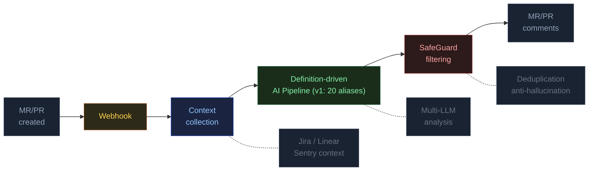
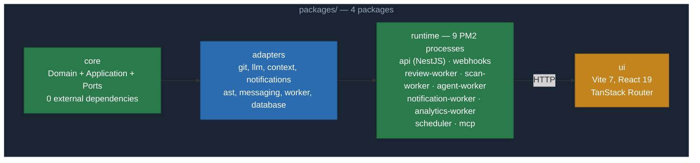
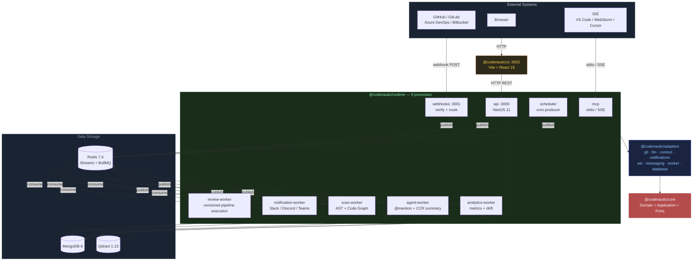
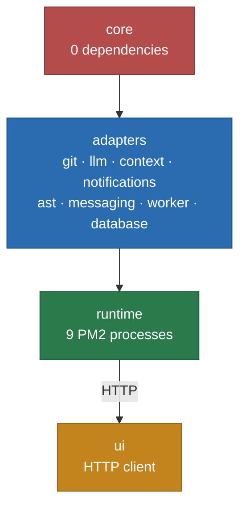
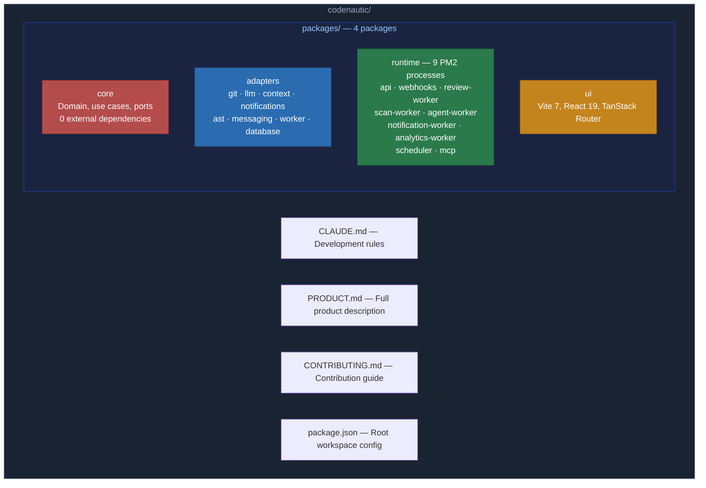

# CodeNautic

**AI-powered code intelligence platform** — automated code review, architecture analysis, codebase visualization, and
problem zone prediction.

[](https://www.typescriptlang.org/)
[](https://bun.sh/)
[](https://nestjs.com/)
[](./LICENSE)

---

## Overview

CodeNautic automatically analyzes merge requests using LLMs and provides developers with contextual feedback. The system
integrates with GitHub, GitLab, Azure DevOps, and Bitbucket, supports multiple AI providers (OpenAI, Anthropic, Google,
Groq), and enriches review context with data from Jira, Linear, Sentry, and other sources.

### How It Works



1. Git platform sends a webhook when an MR/PR is created
2. CodeNautic collects the diff, linked tasks, and error history
3. Code passes through an orchestrated definition-driven pipeline (v1 has 20 stage aliases)
4. SafeGuard filters hallucinations, duplicates, and irrelevant findings
5. Results are published as comments on the MR/PR
6. The system learns from developer feedback

---

## Features

### Core

- **Definition-Driven Review Pipeline** — orchestrated execution from `PipelineDefinition` (v1 has 20 stage aliases), run version pinning, checkpoint/resume support
- **SafeGuard** — 5 filters to combat AI artifacts: deduplication, anti-hallucination, severity threshold,
  prioritization, relevance check
- **Expert Panel** — multiple LLMs analyze code in parallel, results are aggregated
- **Continuous Learning** — the system learns from team feedback and tracks rule effectiveness
- **Custom Rules** — user-defined review rules with inheritance (organization > project > repository)

### Code Analysis

- **AST Analysis** — Tree-sitter parsing, dependency graph, PageRank, Impact Analysis
- **Architecture Analysis** — cyclic dependency detection, coupling analysis
- **CCR Summary** — automatic AI-generated code change request descriptions

### Interactivity

- **Conversation Agent** — AI agent in CCR comments via @mentions
- **Review Depth Modes** — configurable review depth (quick / standard / deep)
- **Directory-level Config** — different settings for different parts of the codebase

### Platform

- **Multi-Tenancy** — data isolation via OrganizationId
- **RBAC** — 4 roles with CASL authorization
- **Audit Logs** — complete action logging
- **Encryption** — AES-GCM secret encryption

---

## Integrations

| Category      | Available                                                     | Planned                           |
|---------------|---------------------------------------------------------------|-----------------------------------|
| Git Platforms | GitHub, GitLab, Azure DevOps, Bitbucket                       | —                                 |
| LLM Providers | OpenAI, Anthropic, Google, Groq, OpenRouter, Cerebras, Novita | —                                 |
| Context       | Jira, Linear, Sentry, Asana, ClickUp                          | Datadog, Bugsnag, PostHog, Trello, Notion |
| Notifications | Slack, Discord, Teams                                         | —                                 |
| AST Parsers   | TypeScript, JavaScript, Python, Go, Java, Rust, PHP, C#, Ruby | Kotlin                            |

---

## Architecture

Clean Architecture + Hexagonal (Ports & Adapters) + DDD in a monorepo with 4 packages:



**Dependency rule:** Infrastructure -> Application -> Domain. Never the other way around.

### System Overview — 9 PM2 Processes



### Package Dependency Graph



> Phase 1 (core) -> Phase 2 (adapters) -> Phase 3 (runtime — 9 PM2 processes) -> Phase 4 (ui)

For more on the architecture, see [PRODUCT.md](./PRODUCT.md).

---

## Tech Stack

| Category    | Technologies                                                                                 |
|-------------|----------------------------------------------------------------------------------------------|
| Runtime     | Bun 1.2, TypeScript 5.7                                                                      |
| Backend     | NestJS 11, Pino, PM2                                                                         |
| Frontend    | Vite 7, React 19, TanStack Router, Tailwind CSS 4, shadcn/ui (Radix + CVA), Recharts, Sonner |
| Database    | MongoDB 8 (mongoose), Qdrant 1.13                                                            |
| Queue/Cache | Redis 7.4 (Redis Streams), BullMQ                                                            |
| Validation  | Zod                                                                                          |
| Security    | Helmet, CORS, CASL, AES-GCM                                                                  |
| LLM         | openai, @anthropic-ai/sdk, @google/genai, Vercel AI SDK                                      |
| Git         | @octokit/rest, @gitbeaker/rest                                                               |
| AST         | tree-sitter                                                                                  |

---

## Quick Start

### Prerequisites

- [Bun](https://bun.sh/) >= 1.2
- [MongoDB](https://www.mongodb.com/) >= 8.0
- [Redis](https://redis.io/) >= 7.4
- [Qdrant](https://qdrant.tech/) >= 1.13

### Installation

```bash
git clone https://github.com/samiyev/codenautic.git
cd codenautic
bun install
```

### Configuration

```bash
cp packages/runtime/.env.example packages/runtime/.env
cp packages/ui/.env.example packages/ui/.env
```

Fill in the `.env` files with your API keys for Git platforms, LLM providers, and external services.

### Build and Run

```bash
cd packages/<pkg> && bun run build       # Build a package
cd packages/<pkg> && bun run typecheck   # Type check
cd packages/<pkg> && bun run lint        # Lint
cd packages/<pkg> && bun test            # Tests
```

---

## Commands

```bash
bun install                                             # Install dependencies
cd packages/<pkg> && bun run build                      # Build a package
bun run --filter @codenautic/<pkg> build               # Build via filter from root
cd packages/<pkg> && bun run clean                      # Clean dist/
cd packages/<pkg> && bun run typecheck                  # Type check
cd packages/<pkg> && bun test                           # Run tests
cd packages/<pkg> && bun run format                     # Format (Prettier)
cd packages/<pkg> && bun run lint                       # ESLint
```

> **Note:** Running `bun test path/to/file` from the monorepo root does not work with Bun workspaces. Always `cd` into
> the package directory first.

---

## Project Structure

> Diagram below is conceptual and reflects layer/package boundaries. Internal folders and file paths may evolve.



---

## Development

### Principles

- **TDD** — tests first, then code (Red > Green > Refactor)
- **Clean Architecture** — Domain knows nothing about Infrastructure
- **DDD** — Entities with behavior, Value Objects, Domain Events
- **SOLID** — one file = one class, small interfaces
- **Result pattern** — `Result.ok()` / `Result.fail()` instead of exceptions

### Code Style

- 4 spaces, no semicolons, double quotes
- `strict: true`, `noUncheckedIndexedAccess: true`
- Only `/** JSDoc */` comments, never `//`
- `unknown` instead of `any`, union types instead of `enum`
- Test coverage: 99% lines, 99% functions

### Commits

Conventional Commits: `<type>(<scope>): <subject>`

```
feat(core): add review service wiring for pipeline orchestration and deterministic result handling across use case boundaries
fix(git-providers): handle api rate limiting with retry backoff strategy and explicit error mapping for stable adapter behavior
test(core): add unit tests for severity value object validation and deterministic comparison across edge case inputs
```

Commit header policy:

- Use imperative mood and lowercase style
- Keep header length at least 80 characters
- Include a commit body with at least 20 words explaining context and intent
- Keep commits atomic: one logical change per commit
- Enforcement is automatic via local `commit-msg` hook, CI `Commit Policy`, and PR `Policy Guard`
- For hard push blocking in all branches, enable GitHub rulesets with required checks

For detailed rules, see [CONTRIBUTING.md](./CONTRIBUTING.md).

---

## Roadmap

The project is planned for 33+ versions. Current progress: **0%** (0 of 1112 tasks).
This reflects implementation status by package TODOs; structural product coverage is tracked separately in
[PRODUCT_COVERAGE.md](./PRODUCT_COVERAGE.md).

| Phase | Packages                                                   | Status |
|-------|------------------------------------------------------------|--------|
| 1     | core                                                       | 0%     |
| 2     | adapters (providers, ast, messaging, worker-infra)        | 0%     |
| 3     | runtime (api, webhooks, workers, scheduler, mcp)          | 0%     |
| 4     | ui                                                         | 0%     |

Current priorities:

- Causal Analysis Overlays — DTOs for CodeCity visualization
- Repository Onboarding — scanning and indexing repositories
- API Controllers — Projects, Analytics, Graph endpoints
- Worker — BullMQ background processing
- UI — dashboard and main pages

Full roadmap per package is split into:

- `packages/<name>/TODO.md` (index)
- `packages/<name>/todo/*.md` (detailed milestones and tasks)

---

## Documentation

| Document                                      | Description                             |
|-----------------------------------------------|-----------------------------------------|
| [PRODUCT.md](./PRODUCT.md)                    | Full product description                |
| [ROADMAP.md](./ROADMAP.md)                    | Strategic roadmap and milestone order   |
| [PRODUCT_COVERAGE.md](./PRODUCT_COVERAGE.md)  | Product-to-task coverage and risk gates |
| [CONTRIBUTING.md](./CONTRIBUTING.md)          | Contribution guide                      |
| `packages/<name>/TODO.md` + `todo/*.md`       | Per-package task index and split tasks  |

---

## License

[MIT](./LICENSE)
