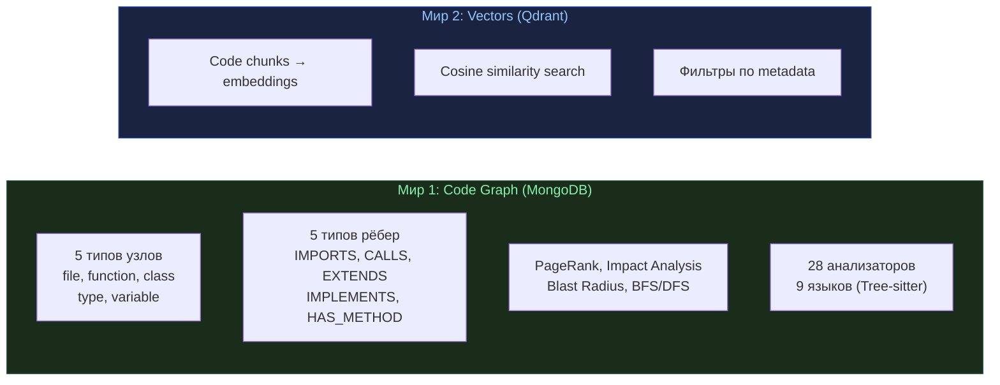
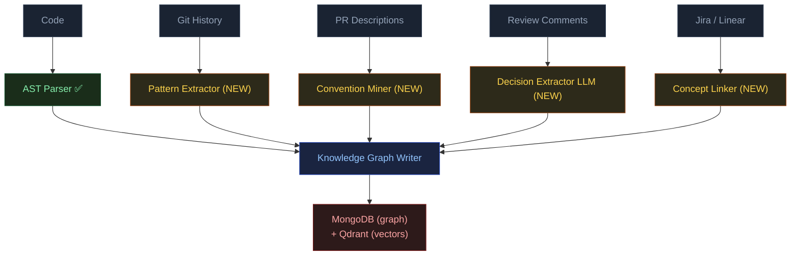
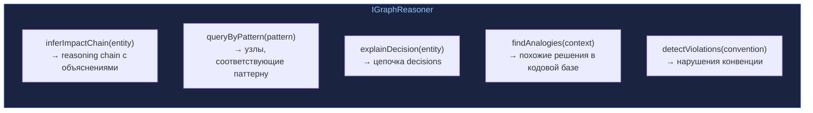
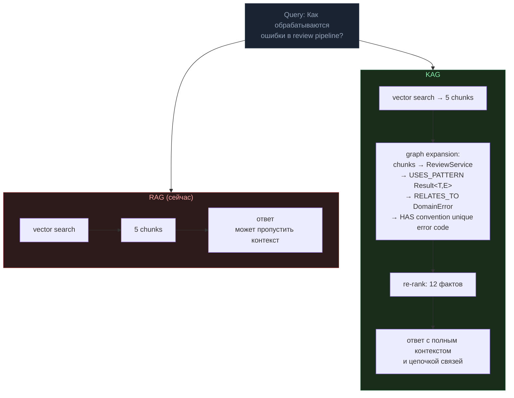
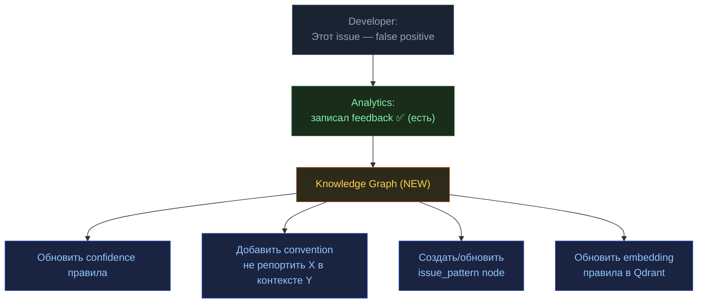
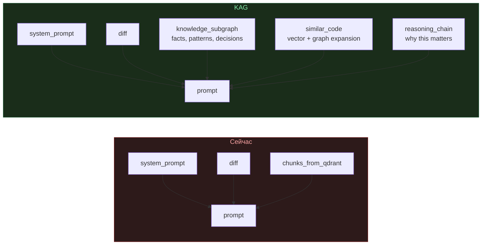
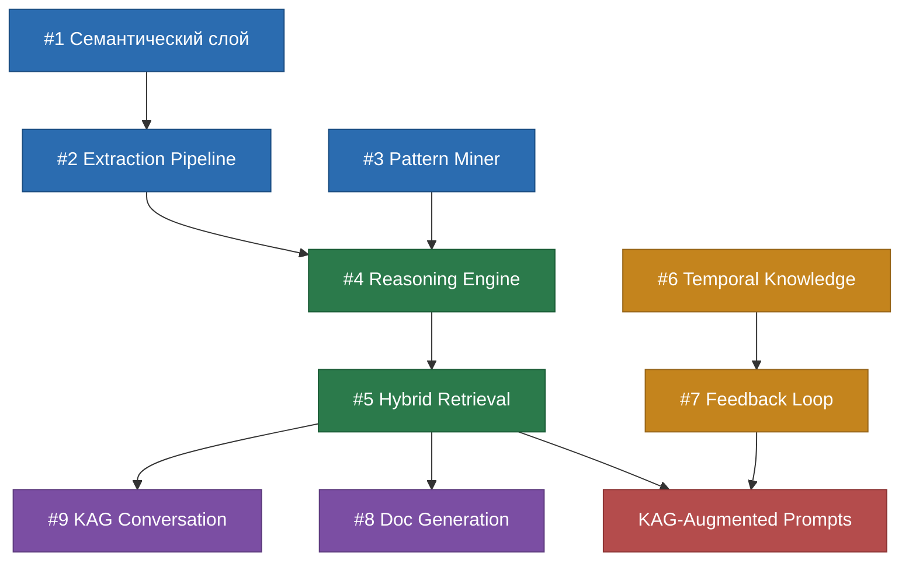
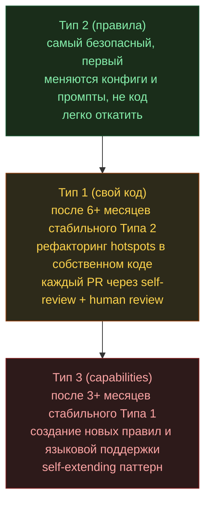

# CodeNautic — Стратегический Roadmap

> Четыре фазы: Launch → KAG Foundation → Расширение → Self-Improvement.
> Подробное описание продукта и текущих возможностей — в `PRODUCT.md`.
> Матрица соответствия продукта задачам и go/no-go риски — в `PRODUCT_COVERAGE.md`.

---

## Milestones — порядок работы

> 18 milestones, сверху вниз = порядок реализации. Каждый milestone = инкрементально проверяемый результат.
> Задачи milestones распределены по индексам и split-файлам пакетов:
> `packages/<name>/TODO.md` + `packages/<name>/todo/*.md`.

### Граф зависимостей

```
M01 → M02 → M03 → M04 → M05 (core)
                              ↓
                        M06 (adapters infra)
                              ↓
                        M07 (API starts)
                              ↓
                        M08 (First E2E)
                              ↓
                        M09 (Workers)
                              ↓
                        M10 (UI Dashboard)
                       ↙ ↓ ↘
                 M11 M12 M13 M14 (параллельно)
                       ↘ ↓ ↙
                        M15 (Advanced core)
                              ↓
                        M16 (Full adapters)
                              ↓
                        M17 (Production)
                              ↓
                        M18 (KAG)
```

### Таблица milestones

| ID | Название | Пакеты | Задач | Проверка |
|----|----------|--------|-------|----------|
| M01 | Core Foundation | core | 27 | `cd packages/core && bun test` — Entity, VO, Result, Errors, Utils |
| M02 | Review Domain & Versioned Pipeline | core | 35 | Review aggregate, orchestrator + pipeline definition с mock stages |
| M03 | 20-Stage (v1) Pipeline & SafeGuard | core | 26 | Полный definition-driven pipeline + SafeGuard с моками |
| M04 | Business Domain | core | 63 | Org, Project, Rules, Feedback, Prompts, Analytics, Graph, Notifications, CCR Summary |
| M05 | Seeds, Admin, Expert Panel | core | 95 | Admin CRUD, seed data, stage-prompt wiring, Expert Panel |
| M06 | Adapters Foundation | adapters | 25 | DB, messaging, worker infra |
| M07 | Git + LLM + API Start | adapters, runtime | 18 | `bun run dev:api` стартует, health, admin CRUD |
| M08 | Webhooks & Review E2E | runtime | 32 | GitHub webhook → queue → pipeline → комментарии в PR |
| M09 | Workers & Notifications | adapters, runtime | 33 | 7 процессов, Slack, метрики, cron |
| M10 | UI Foundation & Dashboard | runtime, ui | 84 | Dashboard в браузере с реальными данными |
| M11 | Agent Worker & Chat | core, runtime, ui | 55 | @mention → AI ответ, чат панель |
| M12 | AST, Scan, Onboarding | core, adapters, runtime, ui | 71 | Все 9 PM2 процессов, onboarding |
| M13 | CodeCity & Review UI | adapters, runtime, ui | 32 | CodeCity 2D treemap, diff viewer |
| M14 | All Providers & Pages | adapters, runtime, ui | 34 | GitLab, Anthropic, Discord — все провайдеры |
| M15 | Advanced Core Features | core | 92 | Causal analysis, drift, predictions, reports |
| M16 | Full Adapters | adapters | 115 | 9 языков AST, все adapter features |
| M17 | Full UI + Production | runtime, ui | ~250 | Docker Compose, CI/CD, все UI страницы |
| M18 | KAG | core, adapters, runtime | 28 | Knowledge Graph, KAG-powered review и chat |

---

## Фаза 1: Launch — полноценный запуск

**Цель:** работающий продукт end-to-end. MR открыт → webhook → definition-driven review pipeline (v1: 20 aliases) →
комментарии в CCR. Dashboard,
analytics, настройки — через UI. Все 4 Git-платформы, все LLM-провайдеры, все 5 трекеров задач.

### Текущее состояние разработки

| Пакет               | Задач    | Выполнено | Осталось | Прогресс |
|---------------------|----------|-----------|----------|----------|
| core                | 394      | 0         | 394      | 0%       |
| adapters            | 200      | 0         | 200      | 0%       |
| runtime             | 283      | 0         | 283      | 0%       |
| ui                  | 235      | 0         | 235      | 0%       |
| **Итого**           | **1112** | **0**     | **1112** | **0%**   |

> Источник правды по задачам: `packages/<name>/TODO.md` + `packages/<name>/todo/*.md`
> OPS-задачи: runtime (API-OPS v0.29-v0.30, WH v0.9, SCAN v0.5). KAG-задачи: core (v0.64-v0.65),
> adapters/ast (v0.19-v0.23), runtime workers (analytics v0.5-v0.6, scan v0.4, agent v0.5, review v0.6).

### Что готово

- **Core (0%):** Versioned review pipeline (v1: 20-stage aliases), SafeGuard (5 фильтров), Expert Panel, Rules Library, Analytics, Architecture
  Analysis, CCR Summary, Conversation Agent, CodeCity Domain, Causal Analysis, KAG порты
- **API (0%):** NestJS, Auth (JWT + RBAC), Security (AES-256-GCM), Observability (Sentry + OTel + Prometheus), Admin
  CRUD, Core controllers, Outbox pattern, MCP module, Task management
- **Providers (0%):** 4 Git-платформы + Rate limiting + Retry + Health checks + Repository Scanning, 7
  LLM-провайдеров + LangChain + Observability + Prompt Library, 5 трекеров задач
- **Notifications (0%):** Slack, Discord, Teams, Report delivery, Scheduled/Drift notifiers
- **MCP (0%):** Transport, Tool/Resource handlers
- **Worker Infra (0%):** BullMQ adapters, Redis, DLQ, Circuit Breaker, Outbox/Inbox processors
- **Messaging (0%):** Outbox/Inbox (MongoDB), Scan + Causal topics
- **Database (0%):** MongoDB adapters, repository implementations
- **AST (0%):** 9 языков (Tree-sitter), Code Graph, PageRank, Impact Analysis, Clusters, Graph Diff
- **Webhooks (0%):** Handlers для 4 платформ, Signature verification, Security, Inbox/Outbox, Mentions,
  Push-reindex, E2E tests
- **UI (0%):** App Router, Auth, Design System (HeroUI v3 migration target), Layout, Forms, Core pages, Dashboard widgets
- **Workers (0%):** Review Worker, Scheduler, Scan Worker, Notification Worker,
  Analytics Worker, Agent Worker

### Что в работе (P0-P3)

**P0 — блокеры Launch:**

- Review Worker: Code review processor, TaskProcessor, TaskResultWriter, ReviewJobConsumer,
  ReviewPipelineOrchestrator, PipelineDefinitionProvider, RunCheckpointStore, ReviewWorkerContainer,
  ReviewWorkerEntrypoint, ResultPublisher, ReviewCommentWriter
- Scan Worker: RepositoryScanConsumer, ScanWorkerContainer, ScanWorkerEntrypoint
- Notification Worker: NotificationJobConsumer, NotificationRouter, NotificationWorkerContainer,
  NotificationWorkerEntrypoint
- Analytics Worker: MetricsConsumer, MetricsProcessor, AnalyticsWorkerContainer, AnalyticsWorkerEntrypoint
- Scheduler: CronScheduler, JobPublisher, SchedulerContainer, SchedulerEntrypoint
- Agent Worker: ChatJobConsumer, ChatJobProcessor, AgentWorkerContainer, AgentWorkerEntrypoint
- Webhooks: Inbox/Outbox integration
- Worker Infra: OutboxRelayWorker, InboxConsumer, Job management (timeout, retry, dedup, priority)
- Deployment: Docker Compose, PM2 ecosystem, CI/CD, env configs (см. Deployment ниже)

**P1 — первый релиз:**

- Review Worker: TaskProgressEmitter, TaskTimeoutHandler, ReviewStatusUpdater, SafeGuardGate, ExpertPanelOrchestrator,
  ReviewRetryHandler
- Scan Worker: RepositoryScanJob, IncrementalScanJob, ScanProgressTracker, IncrementalScanConsumer, EmbeddingIndexer,
  GraphPersister, MetricsCalculator
- Notification Worker: ReportDeliveryConsumer, SlackHandler, DiscordHandler, TeamsHandler, DeliveryRetryManager
- Analytics Worker: FeedbackConsumer, FeedbackProcessor, DriftScanConsumer, DriftScanProcessor,
  CodeHealthTrendCalculator, PredictionComputeJob, PredictionExplainJob, ReportGenerationJob
- Scheduler: ReportDeliveryJob, DriftScanJob, HealthCheckJob
- Agent Worker: CCRSummaryJobConsumer, CCRSummaryProcessor, StreamingChatProcessor, EnhancedRAGContext,
  SystemPromptBuilder
- Webhooks: Interactive Mentions, Push-triggered Reindex
- AST: Worker infrastructure, Import resolution, Function analysis, Full repository scan
- Git Providers: Repository scanning (clone, file tree, blame, history, branches, contributors)
- UI: Additional pages (Integrations, Webhooks, Token usage, Org settings), Conversation Chat UI

**P2 — расширение:**

- LLM Providers: Prompt template manager, Chain builder, Callback handler
- LLM Providers: LangSmith tracing service, LLM call logger (v0.7.0)
- LLM Providers: Prediction & Explanation Prompts (v0.8.0)
- Review Worker: (нет P2 задач)
- Scan Worker: ScheduledRescanProcessor, CleanupManager
- Notification Worker: EmailHandler, WebhookHandler, NotificationTemplateEngine, DeliveryAuditLogger
- Analytics Worker: TemporalCouplingAnalyzer, CausalAnalysisExecutor, SprintSnapshotCollector
- Scheduler: SprintBoundaryJob, OutboxCleanupJob, ScheduleConfigManager, JobExecutionMetrics
- Agent Worker: ModelSelectionConfig, ConversationMemoryManager, CCRSummaryWriter, CCRSummaryPromptBuilder,
  MentionJobConsumer, ReviewMentionHandler, ExplainMentionHandler, FixMentionHandler, SummaryMentionHandler,
  HelpMentionHandler, ConfigMentionHandler
- Context Providers: Datadog, Bugsnag, PostHog, Trello, Notion, OpenAPI Schema
- AST: Multi-repo service, File metrics, Ownership & Churn, Blueprint validation
- Git Providers: Temporal coupling, File ownership, Contributor graph
- API: Impact Planning, Sprint Gamification, Architecture Drift, Executive Reports, Review Context
- UI: Advanced dashboard, Graph visualization, CodeCity 2D, CCR Summary UI

**P3 — дальний горизонт:**

- CodeCity 3D (Three.js/React Three Fiber), Causal overlays, Onboarding tour
- Refactoring/Impact/Knowledge/Predictive/Sprint/Drift/Reports UI
- **+ 39 новых фич из Фазы 2** (ниже)

### Критический путь (блокеры запуска)

| Компонент                                                           | Статус | Блокер?  | Что осталось                                                         |
|---------------------------------------------------------------------|--------|----------|----------------------------------------------------------------------|
| Core (pipeline, SafeGuard, Expert Panel)                            | ❌ 0%   | **P0**   | Все 394 задачи                                                       |
| Git Providers (GitHub, GitLab, Azure, Bitbucket)                    | ❌ 0%   | **P0**   | Все 27 задач                                                         |
| LLM Providers (7 провайдеров + LangChain + Observability + Prompts) | ❌ 0%   | **P0**   | Все 23 задачи                                                        |
| Context Providers (Jira, Linear, Sentry, Asana, ClickUp)            | ❌ 0%   | **P0**   | Все 15 задач                                                         |
| Notifications (Slack, Discord, Teams)                               | ❌ 0%   | **P0**   | Все 9 задач                                                          |
| Messaging (Outbox/Inbox)                                            | ❌ 0%   | **P0**   | Все 7 задач                                                          |
| Database (MongoDB adapters)                                         | ❌ 0%   | **P0**   | Все 7 задач                                                          |
| MCP                                                                 | ❌ 0%   | **P0**   | Все 4 задачи                                                         |
| Webhooks (handlers + security)                                      | ❌ 0%   | **P0**   | Все 33 задачи                                                        |
| Review Worker (23 задачи)                                           | ❌ 0%   | **P0**   | Все 23 задачи                                                        |
| Scan Worker (17 задач)                                              | ❌ 0%   | **P0**   | Все 17 задач                                                         |
| Agent Worker (26 задач)                                             | ❌ 0%   | **P0**   | Все 26 задач                                                         |
| Notification Worker (14 задач)                                      | ❌ 0%   | **P0**   | Все 14 задач                                                         |
| Analytics Worker (20 задач)                                         | ❌ 0%   | **P0**   | Все 20 задач                                                         |
| Scheduler (12 задач)                                                | ❌ 0%   | **P0**   | Все 12 задач                                                         |
| Worker Infra                                                        | ❌ 0%   | **P0**   | Все 20 задач                                                         |
| API (134 задачи)                                                    | ❌ 0%   | **P0**   | Все 134 задачи                                                       |
| UI                                                                  | ❌ 0%   | **P0**   | Все 235 задач                                                        |
| Deployment                                                          | ❌ 0%   | **P0**   | Docker, PM2, CI/CD, env configs, migrations                          |

### Покрытие текущими TODO

**Полное покрытие.** Все задачи зафиксированы:

- **4 пакета** — `packages/<name>/TODO.md` + `packages/<name>/todo/*.md` (все задачи, включая OPS и KAG, раскиданы по пакетам)
- **BullMQ очереди** — producer-задачи явно покрыты в api (v0.28.0), webhooks (v0.6.0-v0.8.0), scheduler (v0.2.0)

Все gaps закрыты:

| Бывший Gap                  | Статус   | Где покрыт                                                                                                                                       |
|-----------------------------|----------|--------------------------------------------------------------------------------------------------------------------------------------------------|
| Deployment                  | Покрыт   | `packages/runtime/todo/m17-full-ui-production.md` (API-OPS-001..008, v0.29.0)                                                                   |
| E2E тесты                   | Покрыт   | `packages/runtime/todo/m17-full-ui-production.md` (WH-E2E-001, SCAN-016, API-OPS-009..010)                                                      |
| Monitoring                  | Покрыт   | `packages/runtime/todo/m17-full-ui-production.md` (API-OPS-007, v0.29.0)                                                                         |
| KAG Phase 0                 | Покрыт   | `packages/core/todo/m18-kag.md`, `packages/adapters/todo/m18-kag.md`, `packages/runtime/todo/m18-kag.md`                                        |
| analytics.feedback producer | Покрыт   | `packages/runtime/todo/m17-full-ui-production.md` (API-FDBK-001)                                                                                 |

---

## Фаза 0: KAG Foundation — Knowledge Augmented Generation

**Цель:** превратить структурный Code Graph + изолированный Vector Search в единый Knowledge Graph с логическим выводом.
Фундамент, на котором строятся все фичи Фазы 2 (особенно агенты, Auto-Fix, Advisory Engine) и Фаза 3 (Self-Improvement).

**Почему "Фаза 0":** это не фича — это инфраструктура интеллекта. Без KAG агенты (#5-8) — слепые LLM-вызовы. С KAG —
рассуждение по графу знаний. Разница между "найди похожий код" и "объясни почему этот код устроен так и что сломается
если его изменить".

### Что есть сейчас



Это **RAG с графом рядом** — два мира не связаны. KAG их объединяет.

### 9 компонентов KAG

#### 1. Семантический слой графа (расширение типов узлов/рёбер)

Сейчас узлы — синтаксические (AST). Для KAG нужны семантические:

**Новые типы узлов:**

| Тип             | Что хранит                  | Откуда извлекается                    |
|-----------------|-----------------------------|---------------------------------------|
| `pattern`       | Design patterns в коде      | LLM + AST analysis                    |
| `convention`    | Командные конвенции         | LLM + повторяющиеся паттерны          |
| `decision`      | Архитектурные решения (ADR) | Коммиты, PR descriptions, комментарии |
| `concept`       | Бизнес-концепты             | Domain entities, JSDoc, naming        |
| `rule`          | Правила ревью               | Конфиг + обученные правила            |
| `issue_pattern` | Паттерны проблем            | История issues, SafeGuard             |
| `ownership`     | Кто за что отвечает         | Git blame, CODEOWNERS, PR history     |
| `evolution`     | Как код менялся             | Git log, diff history                 |

**Новые типы рёбер:**

| Ребро          | Пример                                                     |
|----------------|------------------------------------------------------------|
| `USES_PATTERN` | `ReviewService` → `Strategy Pattern`                       |
| `VIOLATES`     | `userController.ts` → `"No business logic in controllers"` |
| `DECIDED_BY`   | `MongoDB` → `ADR-003`                                      |
| `OWNED_BY`     | `packages/core/` → `@senior-dev`                           |
| `EVOLVED_FROM` | `ReviewServiceV2` → `ReviewServiceV1`                      |
| `RELATES_TO`   | `Review` entity → `"code review"` concept                  |
| `CAUSES`       | `"circular dependency"` → `"build failure"`                |

**Размер:** M | **Зависит от:** —

#### 2. Knowledge Extraction Pipeline

Сейчас: `Code → AST → Graph`. Для KAG: `Code + History + Context → Knowledge`.



Каждый extractor — отдельный адаптер в `packages/adapters/src/ast/`, реализующий порт из core. Запускается в
scan-worker при индексации репозитория.

**Размер:** XL | **Зависит от:** #1

#### 3. Pattern & Convention Miner

LLM анализирует кодовую базу и извлекает:

- **Patterns:** Strategy, Factory, Repository, Observer — с конкретными instances в коде
- **Conventions:** "все entities создаются через фабрики", "ошибки через Result<T,E>", "тесты when/then"
- **Anti-patterns:** нарушения конвенций, отклонения от командного стиля

Результат → узлы `pattern` и `convention` + рёбра `USES_PATTERN`, `VIOLATES` в Knowledge Graph.

**Размер:** L | **Зависит от:** #1

#### 4. Graph Reasoning Engine

Сейчас: BFS/DFS traversal. Для KAG — логический вывод по графу:

| Возможность                         | Сейчас            | KAG                                           |
|-------------------------------------|-------------------|-----------------------------------------------|
| "Кто зависит от X?"                 | BFS по IMPORTS ✅  | ✅ есть                                        |
| "Что сломается если изменить X?"    | Impact Analysis ✅ | + **почему** сломается (через decision nodes) |
| "Какой паттерн здесь используется?" | —                 | LLM + граф паттернов → reasoning chain        |
| "Почему код устроен так?"           | —                 | Цепочка decision nodes в графе                |
| "Как лучше исправить?"              | —                 | Аналогии + conventions + similar resolutions  |
| "Где нарушается конвенция Y?"       | —                 | Query по `VIOLATES` рёбрам                    |

Интерфейс:



**Размер:** XL | **Зависит от:** #1

#### 5. Hybrid Retrieval (Graph + Vector)

Объединение двух миров в один retrieval pipeline:



Три шага: Semantic Search → Graph Expansion → Re-ranking (LLM).

**Размер:** L | **Зависит от:** #4

#### 6. Temporal Knowledge

Сейчас граф — снимок. KAG знает историю:

- **Evolution timeline:** как менялся файл/модуль за время
- **Trends:** растёт сложность? деградирует покрытие? увеличивается coupling?
- **Decision history:** кто и когда принял решение, как оно повлияло
- **Churn correlation:** частые изменения + высокая сложность = risk zone

Частично покрыто в `analytics-worker` (Drift Detection), но не интегрировано в Knowledge Graph. Нужна интеграция: drift
data → `evolution` узлы + `EVOLVED_FROM` рёбра.

**Размер:** M | **Зависит от:** #1

#### 7. Feedback → Knowledge Loop

Сейчас фидбек записывается в analytics. Для KAG он должен обновлять Knowledge Graph:



Это мост между Фазой 0 (KAG) и Фазой 3 (Self-Improvement): каждый фидбек делает Knowledge Graph точнее.

**Размер:** M | **Зависит от:** #1, #6

#### 8. Documentation Generation (автогенерация документации)

Knowledge Graph содержит **всё** что нужно для генерации документации — паттерны, конвенции, решения, эволюцию,
ownership. Это не просто "JSDoc из AST" — это документация с пониманием **почему** код устроен так.

**Что генерируется:**

| Тип документации                  | Источник в Knowledge Graph                   | Пример                                                         |
|-----------------------------------|----------------------------------------------|----------------------------------------------------------------|
| **README модуля**                 | pattern + convention + concept nodes         | "Модуль использует Strategy Pattern для..."                    |
| **Architecture Decision Records** | decision nodes + DECIDED_BY рёбра            | "ADR-003: MongoDB выбран потому что..."                        |
| **API Documentation**             | AST (function signatures) + convention nodes | OpenAPI spec + контекст использования                          |
| **Onboarding Guide**              | ownership + evolution + concept nodes        | Learning path: "начни с X, потом Y, потому что Z зависит от Y" |
| **Changelog**                     | evolution nodes + temporal knowledge         | "v2.1: изменён ReviewService — причина: ADR-007"               |
| **Module Dependency Map**         | IMPORTS/CALLS рёбра + pattern nodes          | Визуальная карта связей с объяснениями                         |
| **Code Conventions Doc**          | convention nodes + VIOLATES рёбра            | "Конвенции команды + текущие нарушения"                        |

**Как работает:**

```
Trigger (push/schedule/manual)
     ↓
Knowledge Graph Query → собрать subgraph для scope (модуль/репо)
     ↓
Hybrid Retrieval (#5) → обогатить контекстом из vector search
     ↓
LLM Generation → сгенерировать документ по шаблону
     ↓
Diff с текущей документацией → показать что изменилось
     ↓
PR с обновлённой документацией / Dashboard preview
```

**Ключевое отличие от существующих doc-gen инструментов:**

- TypeDoc/JSDoc: генерирует **что** (сигнатуры) — CodeNautic генерирует **почему** (решения, паттерны, контекст)
- Существующий `BrowseDocumentationUseCase` становится **viewer** для сгенерированной документации
- Existing `SearchDocumentationUseCase` ищет по **knowledge-enriched** контенту, не по сырому коду

**Размер:** L | **Зависит от:** #1, #4, #5

#### 9. KAG-Powered Conversation (чат с Knowledge Graph)

Текущий чат (`ChatUseCase`) — RAG: vector search → 5 chunks → LLM. С KAG чат становится **разговором с графом знаний**:

| Вопрос                          | Сейчас (RAG)                      | С KAG                                                                                      |
|---------------------------------|-----------------------------------|--------------------------------------------------------------------------------------------|
| "Как работает авторизация?"     | 5 chunks кода по similarity       | Graph: AuthService → JWT Strategy → decision node "why JWT" → convention "RBAC everywhere" |
| "Что сломается если удалить X?" | Ничего — RAG не знает зависимости | Impact chain через граф: 12 файлов → 3 use cases → blast radius 15%                        |
| "Почему MongoDB?"               | Случайные chunks                  | Decision node: ADR-003, дата, причина, альтернативы                                        |
| "С чего начать новичку?"        | Рандомные README куски            | Onboarding path по ownership + complexity: "X → Y → Z"                                     |

**Изменения в `ChatUseCase`:**

- `buildRAGContext()` → `buildKAGContext()`: Hybrid Retrieval (#5) вместо голого vector search
- System prompt обогащается knowledge subgraph: паттерны, конвенции, решения для scope запроса
- Reasoning chain в ответах: не только "вот код", но "вот почему код устроен так"
- Fix `_repositoryId` баг: фильтрация по конкретному репо

**Prerequisites:** agent-worker v0.1.0-v0.3.0 (базовый чат должен работать end-to-end)

**Размер:** M | **Зависит от:** #4, #5, agent-worker v0.3.0

### KAG-Augmented LLM Prompts

Финальная интеграция — как LLM использует Knowledge Graph:



Это не отдельный компонент — это изменение в review-worker и agent-worker, которое использует Hybrid Retrieval (#5) для
построения контекста.

### Критический путь



**Минимальный KAG (MVP):** #1 → #2 → #4 → #5 → KAG Prompts. Остальное — итеративно.

### Что есть и что строить

| Компонент            | Есть (%) | Что переиспользуем                                                           | Что строить                                                                   |
|----------------------|----------|------------------------------------------------------------------------------|-------------------------------------------------------------------------------|
| Семантический слой   | 0%       | `ICodeNode`, `ICodeEdge` types                                               | 8 новых типов узлов, 7 типов рёбер                                            |
| Extraction Pipeline  | 30%      | AST Parser, `scan-worker` infra                                              | 4 новых extractor-а (Pattern, Convention, Decision, Concept)                  |
| Pattern Miner        | 10%      | CircularDependencyDetector, ApiSurface                                       | LLM-based pattern recognition                                                 |
| Reasoning Engine     | 20%      | BFS/DFS, Impact Analysis, PageRank                                           | Multi-hop inference, explanation chains                                       |
| Hybrid Retrieval     | 40%      | `IVectorRepository`, `IGraphRepository`                                      | Объединение, graph expansion, re-ranking                                      |
| Temporal Knowledge   | 25%      | Drift Detection, git-providers                                               | Evolution nodes, trend integration                                            |
| Feedback Loop        | 15%      | Feedback collection в analytics                                              | KG update pipeline                                                            |
| Doc Generation       | 20%      | `BrowseDocumentationUseCase`, `SearchDocumentationUseCase`, LLM providers    | KG-powered generation, diff с текущей документацией, PR creation              |
| KAG Conversation     | 30%      | `ChatUseCase`, `ConversationThread`, `IVectorRepository`, agent-worker infra | Hybrid Retrieval в чате, knowledge subgraph в system prompt, reasoning chains |
| **Общая готовность** | **~20%** |                                                                              |                                                                               |

### Prerequisites из Фазы 1

- [ ] Фаза 1: Launch завершена (definition-driven review pipeline end-to-end, pinning + checkpoint/resume)
- [ ] AST: Full repository scan работает (scan-worker)
- [ ] Git Providers: blame, history, contributors доступны
- [ ] Context Providers: PR descriptions, review comments извлекаемы
- [ ] Qdrant: vector search работает в production
- [ ] MongoDB: graph storage работает в production

### Что KAG даёт другим фазам

**Фаза 2 без KAG vs с KAG:**

| Фича                       | Без KAG                  | С KAG                                                 |
|----------------------------|--------------------------|-------------------------------------------------------|
| AI Auto-Fix (#1)           | Патч по diff + chunks    | Патч с пониманием паттернов и конвенций проекта       |
| Advisory Engine (#9)       | Агрегация метрик         | Рекомендации с reasoning chain: "почему и как"        |
| Refactoring Agent (#6)     | LLM пишет код по hotspot | Агент знает конвенции, паттерны, решения команды      |
| Feature Agent (#7)         | Генерация по описанию    | Генерация, conformant архитектуре и паттернам проекта |
| Pattern Accumulation (#10) | Отдельная фича           | Уже встроено в Knowledge Graph                        |
| Confidence Scoring (#4)    | Статистика acceptance    | + evidence из графа знаний                            |

**Фаза 3 без KAG vs с KAG:**

| Self-Improvement тип | Без KAG                      | С KAG                                                                   |
|----------------------|------------------------------|-------------------------------------------------------------------------|
| Правила (#23)        | A/B по acceptance rate       | + reasoning: "правило X неэффективно потому что конвенция Y изменилась" |
| Свой код (#22)       | Рефакторинг по hotspots      | Рефакторинг с пониманием WHY код устроен так                            |
| Capabilities (#24)   | Генерация правил по запросам | Генерация на основе accumulated knowledge                               |

---

## Фаза 2: Расширение — 39 новых возможностей после Launch

После полноценного запуска — работа над 39 новыми возможностями. Разделены на НОВЫЕ фичи и ДОПОЛНЕНИЯ к существующим.

### Новые фичи (29 позиций)

**Автономия и Auto-Fix:**

| # | Фича                              | Описание                                                                                                                                                                                 | Приоритет |
|---|-----------------------------------|------------------------------------------------------------------------------------------------------------------------------------------------------------------------------------------|-----------|
| 1 | **AI Auto-Fix**                   | Кнопка "Применить исправление" → система создаёт коммит/PR с фиксом. SafeGuard confidence >90% как gate. Sandboxed test execution. Категории: security, стиль, зависимости, простые баги | P0        |
| 2 | **Progressive Autonomy Controls** | Матрица Allow/Ask/Deny per change type, per repo, per team. "Auto-fix стиля — Allow, security fix — Ask, рефакторинг — Deny"                                                             | P1        |
| 3 | **Sandboxed Test Execution**      | Изолированное окружение для запуска тестов против предложенных фиксов. OS-level isolation. Gate: auto-fix публикуется только если тесты зелёные                                          | P1        |
| 4 | **Confidence Scoring**            | Числовой confidence score (0-100%) для каждого finding. Калибровка: predicted vs actual acceptance rate. Gate для автономии: auto-fix >90%, suggest >70%, suppress <50%                  | P1        |

**Агентная платформа (Уровни автономии 2-5):**

| # | Фича                  | Описание                                                                                                                  | Приоритет |
|---|-----------------------|---------------------------------------------------------------------------------------------------------------------------|-----------|
| 5 | **PR из бага**        | Sentry error → анализ stack trace + git blame → root cause → PR с fix + regression test. Self-review через Expert Panel   | P2        |
| 6 | **Refactoring Agent** | Hotspot → план рефакторинга → серия мелких PR → каждый self-reviewed. Architecture Drift как guardrail. Delegator pattern | P3        |
| 7 | **Feature Agent**     | PM описание (epic) → декомпозиция → architecture-conformant plan → multi-file implementation + тесты → self-review        | P3        |
| 8 | **Planning Agent**    | Бизнес-требования → tech spec, complexity estimation на основе code graph, task assignment по bus factor + ownership      | P3        |

**Интеллект и рекомендации:**

| #  | Фича                         | Описание                                                                                                                                                              | Приоритет |
|----|------------------------------|-----------------------------------------------------------------------------------------------------------------------------------------------------------------------|-----------|
| 9  | **Advisory Engine**          | Агрегация данных из всех фич в единую рекомендацию. "Файл X — hotspot #1, bus factor 1, нарушает boundary → конкретный план: извлечь Y, назначить Z, разбить на 3 PR" | P1        |
| 10 | **Pattern Accumulation**     | Агрегация решений из тысяч PR: "hotspot type A → resolution B → результат C". Аналог опыта senior-разработчика                                                        | P2        |
| 11 | **Selective Rule Injection** | Compact XML-каталог eligible правил (~97 символов/правило). LLM сам выбирает нужные для конкретного diff. Масштабирование до тысяч правил: ~100K токенов → ~2.6K      | P1        |
| 12 | **A/B Testing правил**       | Две версии правила одновременно → метрика acceptance rate → автоматический выбор победителя                                                                           | P2        |

**Каналы и интеграции:**

| #  | Фича                               | Описание                                                                                                                                | Приоритет |
|----|------------------------------------|-----------------------------------------------------------------------------------------------------------------------------------------|-----------|
| 13 | **CLI для AI-агентов**             | `codenautic review --plain` → любой AI-агент получает reviewed output. Pipe-friendly формат                                             | P2        |
| 14 | **VS Code + JetBrains extensions** | Real-time review до создания PR. Подсветка проблем inline, quick-fix suggestions                                                        | P2        |
| 15 | **Proactive Guardian (бот)**       | Cron-дайджест в Telegram/Slack: "3 новых hotspot, bus factor упал в модуле X". Trend и drift alerts. Персонализация                     | P2        |
| 16 | **Hub-and-Spoke Gateway**          | Единый Gateway с message normalization. Все каналы (webhook, CLI, Telegram, IDE) как спицы. Добавить канал = один адаптер               | P2        |
| 17 | **OpenClaw Skill**                 | Публикация CodeNautic как Skill в ClawHub. Доступ к 196K+ аудитории. Агенты OpenClaw вызывают review как skill                          | P2        |
| 18 | **Codebase Intelligence API**      | MCP-совместимый API: third-party агенты потребляют CodeNautic intelligence. "Дай hotspots для repo X", "какие rules нарушает этот diff" | P2        |

**Enterprise и compliance:**

| #  | Фича                     | Описание                                                                                                                      | Приоритет |
|----|--------------------------|-------------------------------------------------------------------------------------------------------------------------------|-----------|
| 19 | **SOC 2 Compliance**     | Compliance-ready audit logging, data retention policies, access control documentation, incident response                      | P2        |
| 20 | **EU AI Act Compliance** | Документация pipeline, opt-out для repo/файла, explainability решений, human-in-the-loop гарантии. Enforceable с августа 2026 | P2        |
| 21 | **Enterprise SSO**       | SAML 2.0 (Okta, Azure AD, OneLogin), SCIM provisioning, directory sync                                                        | P2        |

**Self-Improvement (три типа):**

| #  | Фича                                                | Описание                                                                                                                                | Приоритет |
|----|-----------------------------------------------------|-----------------------------------------------------------------------------------------------------------------------------------------|-----------|
| 22 | **Self-Improvement Тип 1: рефакторинг своего кода** | CodeNautic запускает Hotspot Analysis на СВОЁМ коде → генерирует PR с рефакторингом → self-review → команда мержит                      | P3        |
| 23 | **Self-Improvement Тип 2: улучшение правил**        | Анализ acceptance/rejection статистики → "SEC-007 отклонили 34% в тестовых файлах → исключить, поднять threshold". Самый безопасный тип | P2        |
| 24 | **Self-Improvement Тип 3: новые capabilities**      | "5 клиентов спрашивали про Terraform" → автоматическая генерация набора правил + тесты. Self-extending                                  | P3        |

**Масштабирование:**

| #  | Фича                              | Описание                                                                                                     | Приоритет |
|----|-----------------------------------|--------------------------------------------------------------------------------------------------------------|-----------|
| 25 | **Multi-repo Orchestration**      | Анализ сотен interconnected сервисов как единой системы. Cross-repo drift, dependency graph, impact analysis | P3        |
| 26 | **Agent SDK + Marketplace**       | SDK для кастомных агентов поверх code graph + review intelligence. Marketplace для third-party агентов       | P3        |
| 27 | **Proprietary Fine-tuned Models** | Собственные fine-tuned модели для code review. Обучение на accumulated patterns. Снижение LLM dependency     | P3        |
| 28 | **Benchmark Regression Suite**    | Benchmark-тесты для self-improvement: accuracy на known issues >= X%. Auto-reject PR при деградации          | P3        |
| 29 | **Transparency Reports**          | Публичные метрики самосовершенствования: "В этом месяце accuracy выросла с 78% до 84%". Trust-building       | P3        |

### Дополнения к существующим фичам (10 позиций)

| #  | Существующая фича              | Дополнение                                                                                                                                     | Приоритет |
|----|--------------------------------|------------------------------------------------------------------------------------------------------------------------------------------------|-----------|
| 30 | Expert Panel                   | **Ensemble Verification** — несколько моделей валидируют каждый auto-fix. Self-review автогенерированных PR                                    | P1        |
| 31 | Hierarchical Rules             | **Skills-as-Markdown** — правила как Markdown файлы (паттерн OpenClaw). RuleHub — маркетплейс правил                                           | P2        |
| 32 | Predictive Hotspots            | **Actionable Hotspots** — привязка к плану рефакторинга из 3 PR. Trend extrapolation: "через 2 спринта complexity +40%"                        | P2        |
| 33 | Architecture Drift             | **Guardrails для агента** — drift detection проверяет автогенерированный код в реальном времени. Self-check на собственной кодовой базе        | P2        |
| 34 | Bus Factor                     | **Reviewer Assignment** — автоматическое назначение ревьюеров. Knowledge transfer recommendations. Интеграция с Task Tracker                   | P2        |
| 35 | Task Tracker                   | **Task-to-PR Pipeline** — обратная связь: тикет → автоматический PR. Bug-to-PR: Sentry error → PR с fix + test                                 | P2        |
| 36 | CodeCity                       | **Spatial Understanding** — code graph как queryable database. Рефакторинг-визуализация: "как будет выглядеть город после"                     | P3        |
| 37 | Notifications                  | **Proactive Digests** — персонализированный cron-дайджест. Escalation: hotspot не адресуется 2 спринта → алерт тимлиду                         | P2        |
| 38 | Review Pipeline                | **Self-Review** — тот же definition-driven pipeline (v1: 20 aliases) для review автогенерированного кода. Рекурсия: агент пишет → pipeline ревьюирует → агент исправляет | P1        |
| 39 | Feedback / Continuous Learning | **Rule Tuning Automation** — auto-анализ: правило X отклоняют >30% → PR с настройкой. A/B testing. Confidence calibration                      | P2        |

---

## Фаза 3: Self-Improvement — продукт улучшает себя

**Концепция:** CodeNautic применяет ВСЕ свои capabilities к СОБСТВЕННОЙ кодовой базе. Каждый цикл улучшает и продукт, И
качество следующего цикла. Compounding advantage.

**Цикл:**

1. Hotspot Analysis на СВОЁМ коде → находит проблемные модули
2. Bus Factor на СВОЕЙ команде → определяет risk zones
3. Architecture Drift на СВОЁМ дизайне → находит отклонения
4. Advisory Engine → генерирует конкретную рекомендацию
5. CodeNautic Agent → ПИШЕТ код → СОЗДАЁТ PR → РЕВЬЮИРУЕТ свой PR через Expert Panel + SafeGuard
6. Команда ревьюирует → мержит → CodeNautic стал лучше → GOTO 1

### Prerequisites — что должно быть готово

**Для Self-Improvement Тип 1 (рефакторинг своего кода):**

- [ ] Фаза 1: Launch завершена (полный definition-driven review pipeline работает)
- [ ] AI Auto-Fix (#1) работает и откалиброван (acceptance rate >70%)
- [ ] Confidence Scoring (#4) откалиброван на реальных данных
- [ ] Sandboxed Test Execution (#3) работает
- [ ] Benchmark Regression Suite (#28) создан и покрывает критические сценарии
- [ ] Predictive Hotspots работают (для нахождения целей рефакторинга)
- [ ] Architecture Drift Detection работает (для guardrails)
- [ ] Review Pipeline → Self-Review (#38) реализован

**Для Self-Improvement Тип 2 (улучшение правил) — самый безопасный, начинаем первым:**

- [ ] Фаза 1: Launch завершена
- [ ] Feedback / Continuous Learning работает (acceptance/rejection data накоплены)
- [ ] Confidence Scoring (#4) откалиброван
- [ ] A/B Testing правил (#12) реализован
- [ ] Rule Tuning Automation (#39) реализована
- [ ] Минимум 1000 review decisions накоплено для статистической значимости

**Для Self-Improvement Тип 3 (новые capabilities):**

- [ ] Self-Improvement Тип 2 работает стабильно >3 месяцев
- [ ] Pattern Accumulation (#10) накопил достаточно паттернов
- [ ] Skills-as-Markdown (#31) реализован (правила как Markdown = агент может создавать)
- [ ] Agent SDK (#26) базовая версия
- [ ] Benchmark Regression Suite (#28) расширен для новых capabilities

### Безопасность Self-Improvement

| Принцип               | Механизм                                                                               |
|-----------------------|----------------------------------------------------------------------------------------|
| Human-in-the-loop     | Каждое self-suggested изменение проходит human review перед merge                      |
| Benchmark gate        | Ни одна модификация не деградирует quality — автоматический откат при падении accuracy |
| Scope containment     | Начинаем с промптов и конфигурации, НЕ core логика                                     |
| Drift self-check      | Architecture Drift Detection на собственных изменениях                                 |
| Statistical threshold | Только N > 10 одинаковых паттернов — не отдельные случаи                               |
| Sandbox isolation     | OS-level isolation для test execution                                                  |
| Transparency          | Публичные отчёты о каждом self-improvement цикле                                       |

### Порядок включения Self-Improvement


