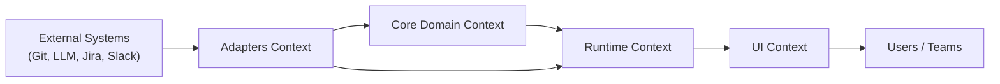

# Context Map v1

> Source of truth для границ контекстов и ACL-переходов в CodeNautic.

## Bounded Contexts

| Context | Назначение | Upstream | Downstream | ACL Boundary |
|---|---|---|---|---|
| `Core Domain` (`@codenautic/core`) | Aggregate, Value Objects, Domain Events, Use Cases, Ports | Нет (источник доменной модели) | `Adapters`, `Runtime` | Не принимает внешние SDK-типы |
| `Adapters` (`@codenautic/adapters`) | Provider integrations и anti-corruption mapping | `Git/LLM/Context/Notification external APIs` | `Core Domain`, `Runtime` | Каждый провайдер маппит external DTO -> core contracts |
| `Runtime` (`@codenautic/runtime`) | Composition roots, workers, API, event orchestration | `Core Domain`, `Adapters`, messaging storage | `UI`, external webhook consumers | Только через порты/контракты core |
| `UI` (`@codenautic/ui`) | Dashboard, review/workflow interfaces | `Runtime API` | Конечные пользователи | HTTP boundary, без прямых импортов core/adapters |

## Upstream/Downstream Graph

## ACL Rules

1. Внешние SDK-типы не проходят в `core` напрямую.
2. Каждый integration adapter обязан иметь отдельный ACL-мэппинг слой.
3. `runtime` использует только контракты `@codenautic/core`, а не external provider SDK.
4. Любой новый upstream интегрируется через `@codenautic/adapters`, а не напрямую в `core` или `ui`.

## Change Policy

1. Изменение границ контекстов требует ADR.
2. Изменение ACL-правил требует обновления `packages/core/todo/*` и `packages/adapters/todo/*` ссылок.
3. Breaking change контракта между контекстами требует migration plan и versioning note.
