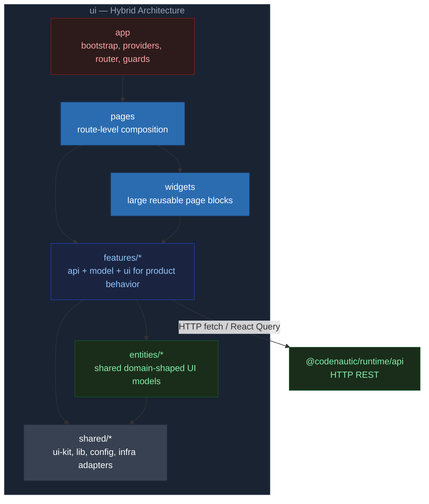

# @codenautic/ui

> Frontend Application — Driving Adapter

---

## Назначение

SPA-приложение для пользователей: dashboard с метриками, browser результатов review, управление правилами, настройки
организации, code graph визуализация.

---

## Текущее состояние

| Аспект      | Значение                                                     |
| ----------- | ------------------------------------------------------------ |
| Версия      | 0.1.0                                                        |
| Статус      | Активная разработка — routing, компоненты, auth              |
| Framework   | Vite 7, React 19, TanStack Router                            |
| Тесты       | Vitest + happy-dom                                           |
| Зависимости | `@codenautic/runtime` (api) через HTTP (fetch + React Query) |

---

## Архитектура



---

## Установка

```bash
bun add @codenautic/ui
```

---

## Ключевые компоненты

- **App shell**: router, providers, guard-слои, layout orchestration
- **Feature modules**: каждая продуктовая зона хранит `api/model/ui` вместе
- **Widget composition**: крупные UI-блоки собирают несколько features
- **Dashboard**: metric cards, activity timeline, health ring, trend indicators, ambient background
- **Code review UI**: diff viewer (split/unified), issue threads, feedback, streaming progress
- **Graph visualization**: file dependency graph, call graph, module graph (XYFlow `@xyflow/react` + dagre layout)
- **Design system**: целевой стек HeroUI v3 (React Aria), миграция из legacy-слоя в процессе
- **Settings**: git providers, LLM providers, code review config, teams, billing, API keys
- **Auth**: protected routes, permissions (CASL), OAuth
- **Observability**: Sentry error reporting, Pyroscope profiling, Web Vitals
- **120+ файлов UI, 90+ тестов**

---

## Tech Stack

| Категория      | Технологии                                                             |
| -------------- | ---------------------------------------------------------------------- |
| Build          | Vite 7                                                                 |
| UI             | React 19                                                               |
| Routing        | TanStack Router (file-based)                                           |
| Server State   | TanStack React Query 5                                                 |
| Forms          | React Hook Form + Zod                                                  |
| Styling        | Tailwind CSS 4, HeroUI v3 (target, migration in progress)              |
| Charts         | Recharts (единственная charting-библиотека)                            |
| Tables         | TanStack Table (enterprise lists)                                      |
| Virtualization | TanStack Virtual                                                       |
| Graph          | XYFlow (`@xyflow/react`) + dagre                                       |
| 3D             | Three.js (CodeCity visualization)                                      |
| i18n           | i18next                                                                |
| Тесты          | Vitest, happy-dom, MSW (API mocking)                                   |
| Components     | Storybook 8                                                            |
| Observability  | Sentry, Pyroscope, OpenTelemetry                                       |
| Analytics      | OSS/self-hostable ingestion + OpenTelemetry events (no mandatory SaaS) |

---

## Stack Decisions (OSS)

> Цель: покрыть весь scope UI и быть готовыми к аудитории уровня `$1M+` без зависимости от paid/pro/enterprise
> лицензий.

- **Core UI layer**: `HeroUI v3` (React Aria) + Tailwind CSS 4 tokens.
- **License policy**: только OSS-зависимости, допускающие коммерческое использование (MIT/Apache-2.0/BSD и аналоги).
- **No paywall**: запрещены библиотеки, где критичные фичи доступны только в Pro/Enterprise.
- **Icons (OSS-only policy)**:

1. Primary icon library: `lucide-react` (дефолт для новых иконок в продуктовых экранах).
2. Allowed secondary library: `@gravity-ui/icons` (если нужен стиль/иконка из примеров HeroUI).
3. Optional fallback: `@iconify/react` только для редких brand/vendor иконок, когда нет эквивалента в primary.
4. Forbidden: `@heroui/pro` и любые paid/proprietary icon packs.
5. Временные emoji-иконки в навигации считаются legacy и постепенно заменяются на библиотечные SVG-иконки.

| Область                         | Основной выбор                                              | Что покрывает                                                                              | Target limits (первые версии)                                                                               | OSS plan B при упоре                                                                 |
| ------------------------------- | ----------------------------------------------------------- | ------------------------------------------------------------------------------------------ | ----------------------------------------------------------------------------------------------------------- | ------------------------------------------------------------------------------------ |
| UI компоненты + a11y            | HeroUI v3 (React Aria)                                      | Button/Input/Select/Modal/Drawer/Tabs/Dropdown/Skeleton и т.д., единая a11y-модель         | HeroUI v3 beta: держим слой адаптеров и Storybook-coverage на базовых компонентах                           | React Aria Components (RAC) + свой ui-kit поверх Tailwind токенов                    |
| Command palette / global search | HeroUI v3 overlay + backend/локальный индекс                | Cmd+K palette, навигация по сущностям, запуск actions                                      | 10k+ сущностей: debounce + memoized index, tenant/permission-safe фильтрация (`WEB-SRCH-004`)               | `cmdk` или `kbar` (MIT) если нужен готовый headless command menu                     |
| Keyboard shortcuts              | Свой registry + hooks                                       | Глобальные и page-scope шорткаты, focus management, cheatsheet (`WEB-KBD-001..002`)        | Конфликт-матрица комбинаций, не перехватывать ввод/IME                                                      | `tinykeys` или `react-hotkeys-hook` как лёгкая OSS-основа                            |
| Enterprise tables               | TanStack Table (`@tanstack/react-table`) + TanStack Virtual | Колонки (hide/pin/reorder/resize), density, keyboard nav, row actions, export, saved views | 10k+ строк на странице с виртуализацией (`WEB-TBL-001`), выше: агрегация/серверный paging                   | `react-virtuoso` для сложных/динамических высот строк + усиление серверной агрегации |
| Graph explorer                  | XYFlow (`@xyflow/react`) + dagre                            | Dependency/call/module graphs, paths highlight, export SVG/PNG, drill-down                 | До ~500-1000 nodes интерактивно; выше: кластеризация + progressive render + fallback (`WEB-GRAPH-010..012`) | Sigma.js (WebGL) или Cytoscape.js для больших графов + отдельный layout слой         |
| Charts                          | Recharts                                                    | KPI, usage, trends, dashboard widgets                                                      | До ~5k-10k points с downsampling/aggregation (`WEB-CHART-001..002`)                                         | Apache-2.0: ECharts для тяжёлых графиков; uPlot для таймсерий                        |
| 3D визуализация                 | three + R3F/drei                                            | CodeCity 3D, camera presets, interactions                                                  | Требует WebGL/GPU; обязателен fallback на 2D и degraded mode                                                | 2D-only режим (CodeCity 2D) + текстовые summaries/exports как стандартный fallback   |
| Rule editor                     | TipTap (только OSS core)                                    | Rich text + code blocks + markdown, lazy-load                                              | Без Pro extensions; сложные enterprise-фичи должны иметь OSS-эквивалент                                     | Lexical (Meta) или Slate как полностью OSS-редактор                                  |
| Code highlight                  | Shiki (lazy-load)                                           | Подсветка diff/chat/rules                                                                  | Тяжёлый бандл: только динамическая загрузка и кэш                                                           | Prism / highlight.js для лёгких режимов                                              |
| UX telemetry + adoption         | In-house события + агрегаты backend                         | time-to-first-value, drop-offs, usage/adoption analytics (`WEB-HOOK-007`, `WEB-PAGE-025`)  | Privacy-by-default: no PII/code, sampling/batching                                                          | OpenTelemetry web events + self-hosted collector как интеграционный слой             |
| E2E a11y/i18n                   | Target: Playwright + axe-core                               | Критичные user journeys + keyboard + screen reader flow (`WEB-E2E-001`)                    | Merge-blocking на регрессии, long-locale/pseudo-locale                                                      | Cypress + axe-core (если Playwright упирается в инфраструктуру)                      |

## Структура

Целевая структура UI: объединяем `feature-first` и `layer-first`.

```text
ui/
  app/            # bootstrap, providers, router, guards
  pages/          # route-level сборка экранов
  widgets/        # крупные UI-блоки (dashboard, review-hub, settings-shell)
  features/       # продуктовые фичи (review, rules, integrations, billing...)
  entities/       # переиспользуемые доменные представления для UI
  shared/         # ui-kit, утилиты, конфиг, infra-клиенты
  tests/          # unit/integration/e2e
```

Контракты слоёв:

- `app/pages/widgets` могут импортировать `features/entities/shared`
- `features` могут импортировать `entities/shared`, но не другие `features` напрямую
- межфичевая интеграция идёт через публичные API модулей (barrel/export contracts)
- `shared` не содержит бизнес-терминов конкретного bounded context
- `routes` остаются тонкими: только матчинг и делегирование в `pages`

Этапы внедрения (1 + 2 + 3):

1. `Layer baseline`: стабилизируем `app/pages/widgets/shared` и route-композицию.
2. `Feature migration`: переносим продуктовую логику из общих `components/lib` в `features/*`.
3. `Contracts hardening`: фиксируем публичные контракты модулей и запрещаем обходные импорты.

Примечание: дерево выше задаёт архитектурный каркас; конкретные файлы и вложенность могут меняться.

---

## Pages

### Dashboard

Главная страница с метриками:

| Widget            | Описание                             |
| ----------------- | ------------------------------------ |
| Metric Cards      | Ключевые числа с трендами            |
| Activity Timeline | Недавние reviews, группировка по дню |
| Health Ring       | Code health индикатор                |
| Stats Cards       | Summary статистика                   |

### Reviews

Браузер результатов review:

| View   | Описание                                         |
| ------ | ------------------------------------------------ |
| List   | Список всех reviews с фильтрами                  |
| Detail | Детали review: issues, timeline                  |
| Issue  | Отдельный issue: code diff, suggestion, feedback |

### Settings

| Section       | Описание                 |
| ------------- | ------------------------ |
| Git Providers | GitHub, GitLab config    |
| LLM Providers | OpenAI, Anthropic config |
| Code Review   | Review settings          |
| Team          | Team management          |
| Billing       | Subscription & billing   |
| API Keys      | Key management           |
| Notifications | Notification preferences |
| Webhooks      | Webhook management       |
| Integrations  | External integrations    |
| Security      | Security settings        |
| Audit Logs    | Activity audit trail     |

---

## State Management

| Type            | Technology            | Примеры                                   |
| --------------- | --------------------- | ----------------------------------------- |
| Server State    | TanStack React Query  | Reviews, permissions, organization, teams |
| URL State       | TanStack Router       | Route params, search params               |
| Form State      | React Hook Form + Zod | Settings forms, rule editor               |
| Client UI State | React state / context | Sidebar, modals, theme                    |

---

## Auth & Permissions

- **Protected routes**: `_authenticated` layout guard
- **Permission component**: `<Can>` — RBAC checks
- **OAuth**: GitHub, GitLab, Google
- **Token management**: access + refresh tokens

---

## Theming

| Mode   | Описание                 |
| ------ | ------------------------ |
| Light  | Default light theme      |
| Dark   | Dark theme               |
| System | Follow system preference |

CSS variables, OKLch color space. Toggle через `theme-toggle.tsx`.

---

## Performance

| Optimization      | Описание                                          |
| ----------------- | ------------------------------------------------- |
| Code Splitting    | Per-route bundles (Vite)                          |
| Lazy Loading      | Dynamic imports для тяжёлых libs (Three.js, etc.) |
| Virtual Scrolling | Для длинных списков issues и PRs                  |
| React Query Cache | Stale-while-revalidate, background refetch        |
| Bundle Analyzer   | Vite bundle analysis                              |

Стратегия eager/lazy и Suspense boundaries: [`ARCHITECTURE.md`](./ARCHITECTURE.md).

---

## i18n

- **Library**: i18next
- **Languages**: English (default), Russian
- Расширяемая архитектура — новый язык = новая папка переводов

---

## Разработка

```bash
bun run dev            # Vite dev server (port 7110)
bun run build          # Vite build
bun run build:analyze  # Vite build + rollup visualizer report
bun run clean          # Очистка dist/ coverage/
bun run preview        # Vite preview (port 7220)
bun run lint           # Линтинг (eslint --fix)
bun run format         # Форматирование (prettier)
bun run format:check   # Проверка форматирования
bun run perf:check     # Проверка performance budget (JS/LCP/INP/CLS)
bun run typecheck      # Проверка типов (tsc --noEmit)
bun run test           # Тесты (vitest, happy-dom)
bun run codegen        # OpenAPI → generated types
bun run codegen:check  # Проверка синхронизации schema и generated types
bun run storybook      # Storybook dev (port 7230)
bun run build-storybook # Storybook build
```

`dev` и `build` автоматически запускают `codegen`, чтобы DTO оставались актуальными после изменения `openapi/schema.yaml`.
Сетевые порты UI и связанных сервисов централизованы в
[`config/service-ports.json`](/Users/fozilbeksamiyev/projects/codenautic/config/service-ports.json).

---

## План задач

- Индекс milestones: [`TODO.md`](./TODO.md)
- Детальные milestone-файлы: [`todo/`](./todo/)

---

## Dependencies

- **@codenautic/runtime (api)** — через HTTP (fetch wrapper + React Query)
- **vite** — build tool
- **react**, **react-dom** — UI library
- **@tanstack/react-router** — file-based routing
- **@tanstack/react-query** — server state management
- **tailwindcss** — utility-first CSS
- **UI component layer** — migration target: HeroUI v3 (React Aria), legacy: shadcn/ui
- **recharts** — charting (единственная библиотека)
- **@tanstack/react-table** — enterprise tables (target, `WEB-TBL-001`)
- **@tanstack/react-virtual** — virtualization для списков/таблиц
- **@xyflow/react** + **@dagrejs/dagre** — graph explorer + auto-layout
- **react-hook-form** + **zod** — form management + validation
- **i18next** — internationalization
- **three** — 3D visualization (CodeCity)
- **msw** — API mocking в тестах
- **@sentry/react** — error reporting
- **Policy** — UI зависимости только OSS (no paid/pro/enterprise лицензий)
