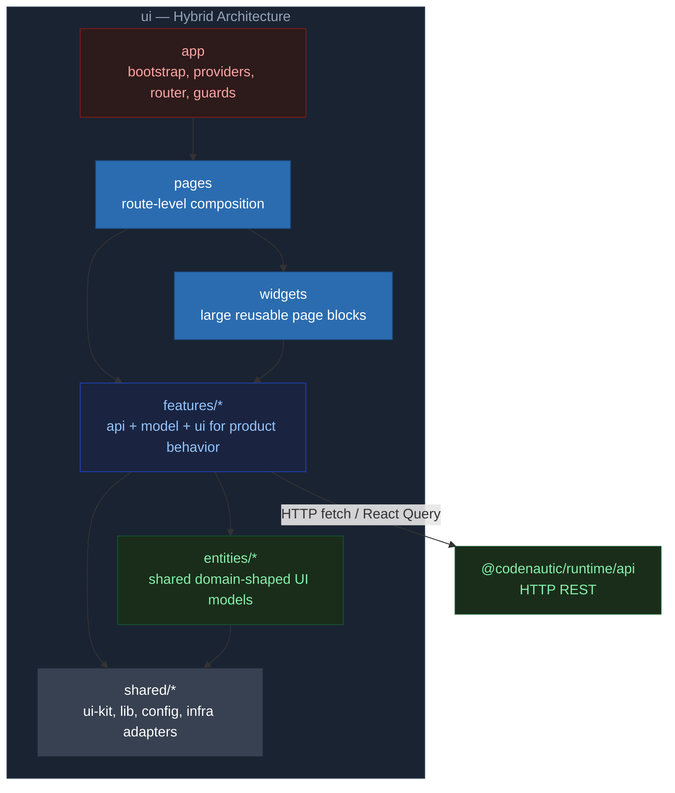

# @codenautic/ui

> Frontend Application — Driving Adapter

---

## Назначение

SPA-приложение для пользователей: dashboard с метриками, browser результатов review, управление правилами, настройки
организации, code graph визуализация.

---

## Текущее состояние

| Аспект      | Значение                                           |
|-------------|----------------------------------------------------|
| Версия      | 0.1.0                                              |
| Статус      | Активная разработка — routing, компоненты, auth    |
| Framework   | Vite 7, React 19, TanStack Router                  |
| Тесты       | Vitest + happy-dom                                 |
| Зависимости | `@codenautic/runtime` (api) через HTTP (fetch + React Query) |

---

## Архитектура



---

## Установка

```bash
bun add @codenautic/ui
```

---

## Ключевые компоненты

- **App shell**: router, providers, guard-слои, layout orchestration
- **Feature modules**: каждая продуктовая зона хранит `api/model/ui` вместе
- **Widget composition**: крупные UI-блоки собирают несколько features
- **Dashboard**: metric cards, activity timeline, health ring, trend indicators, ambient background
- **Code review UI**: diff viewer (split/unified), issue threads, feedback, streaming progress
- **Graph visualization**: file dependency graph, call graph, module graph (React Flow/D3)
- **Design system**: целевой стек HeroUI v3 (React Aria), миграция из legacy-слоя в процессе
- **Settings**: git providers, LLM providers, code review config, teams, billing, API keys
- **Auth**: protected routes, permissions (CASL), OAuth
- **Observability**: Sentry error reporting, Pyroscope profiling, Web Vitals
- **120+ файлов UI, 90+ тестов**

---

## Tech Stack

| Категория     | Технологии                                  |
|---------------|---------------------------------------------|
| Build         | Vite 7                                      |
| UI            | React 19                                    |
| Routing       | TanStack Router (file-based)                |
| Server State  | TanStack React Query 5                      |
| Forms         | React Hook Form + Zod                       |
| Styling       | Tailwind CSS 4, HeroUI v3 (target, migration in progress) |
| Charts        | Recharts (единственная charting-библиотека) |
| 3D            | Three.js (CodeCity visualization)           |
| i18n          | i18next                                     |
| Тесты         | Vitest, happy-dom, MSW (API mocking)        |
| Components    | Storybook 8                                 |
| Observability | Sentry, Pyroscope, OpenTelemetry            |
| Analytics     | PostHog, Segment                            |

---

## Структура

Целевая структура UI: объединяем `feature-first` и `layer-first`.

```text
ui/
  app/            # bootstrap, providers, router, guards
  pages/          # route-level сборка экранов
  widgets/        # крупные UI-блоки (dashboard, review-hub, settings-shell)
  features/       # продуктовые фичи (review, rules, integrations, billing...)
  entities/       # переиспользуемые доменные представления для UI
  shared/         # ui-kit, утилиты, конфиг, infra-клиенты
  tests/          # unit/integration/e2e
```

Контракты слоёв:

- `app/pages/widgets` могут импортировать `features/entities/shared`
- `features` могут импортировать `entities/shared`, но не другие `features` напрямую
- межфичевая интеграция идёт через публичные API модулей (barrel/export contracts)
- `shared` не содержит бизнес-терминов конкретного bounded context
- `routes` остаются тонкими: только матчинг и делегирование в `pages`

Этапы внедрения (1 + 2 + 3):

1. `Layer baseline`: стабилизируем `app/pages/widgets/shared` и route-композицию.
2. `Feature migration`: переносим продуктовую логику из общих `components/lib` в `features/*`.
3. `Contracts hardening`: фиксируем публичные контракты модулей и запрещаем обходные импорты.

Примечание: дерево выше задаёт архитектурный каркас; конкретные файлы и вложенность могут меняться.

---

## Pages

### Dashboard

Главная страница с метриками:

| Widget            | Описание                             |
|-------------------|--------------------------------------|
| Metric Cards      | Ключевые числа с трендами            |
| Activity Timeline | Недавние reviews, группировка по дню |
| Health Ring       | Code health индикатор                |
| Stats Cards       | Summary статистика                   |

### Reviews

Браузер результатов review:

| View   | Описание                                         |
|--------|--------------------------------------------------|
| List   | Список всех reviews с фильтрами                  |
| Detail | Детали review: issues, timeline                  |
| Issue  | Отдельный issue: code diff, suggestion, feedback |

### Settings

| Section       | Описание                 |
|---------------|--------------------------|
| Git Providers | GitHub, GitLab config    |
| LLM Providers | OpenAI, Anthropic config |
| Code Review   | Review settings          |
| Team          | Team management          |
| Billing       | Subscription & billing   |
| API Keys      | Key management           |
| Notifications | Notification preferences |
| Webhooks      | Webhook management       |
| Integrations  | External integrations    |
| Security      | Security settings        |
| Audit Logs    | Activity audit trail     |

---

## State Management

| Type            | Technology            | Примеры                                   |
|-----------------|-----------------------|-------------------------------------------|
| Server State    | TanStack React Query  | Reviews, permissions, organization, teams |
| URL State       | TanStack Router       | Route params, search params               |
| Form State      | React Hook Form + Zod | Settings forms, rule editor               |
| Client UI State | React state / context | Sidebar, modals, theme                    |

---

## Auth & Permissions

- **Protected routes**: `_authenticated` layout guard
- **Permission component**: `<Can>` — RBAC checks
- **OAuth**: GitHub, GitLab, Google
- **Token management**: access + refresh tokens

---

## Theming

| Mode   | Описание                 |
|--------|--------------------------|
| Light  | Default light theme      |
| Dark   | Dark theme               |
| System | Follow system preference |

CSS variables, OKLch color space. Toggle через `theme-toggle.tsx`.

---

## Performance

| Optimization      | Описание                                          |
|-------------------|---------------------------------------------------|
| Code Splitting    | Per-route bundles (Vite)                          |
| Lazy Loading      | Dynamic imports для тяжёлых libs (Three.js, etc.) |
| Virtual Scrolling | Для длинных списков issues и PRs                  |
| React Query Cache | Stale-while-revalidate, background refetch        |
| Bundle Analyzer   | Vite bundle analysis                              |

Стратегия eager/lazy и Suspense boundaries: [`ARCHITECTURE.md`](./ARCHITECTURE.md).

---

## i18n

- **Library**: i18next
- **Languages**: English (default), Russian
- Расширяемая архитектура — новый язык = новая папка переводов

---

## Разработка

```bash
bun run dev            # Vite dev server
bun run build          # Vite build
bun run build:analyze  # Vite build + rollup visualizer report
bun run clean          # Очистка dist/ coverage/
bun run preview        # Vite preview
bun run lint           # Линтинг (eslint --fix)
bun run format         # Форматирование (prettier)
bun run format:check   # Проверка форматирования
bun run perf:check     # Проверка performance budget (JS/LCP/INP/CLS)
bun run typecheck      # Проверка типов (tsc --noEmit)
bun run test           # Тесты (vitest, happy-dom)
bun run codegen        # OpenAPI → generated types
bun run codegen:check  # Проверка синхронизации schema и generated types
bun run storybook      # Storybook dev (port 6006)
bun run build-storybook # Storybook build
```

`dev` и `build` автоматически запускают `codegen`, чтобы DTO оставались актуальными после изменения `openapi/schema.yaml`.

---

## План задач

- Индекс milestones: [`TODO.md`](./TODO.md)
- Детальные milestone-файлы: [`todo/`](./todo/)

---

## Dependencies

- **@codenautic/runtime (api)** — через HTTP (fetch wrapper + React Query)
- **vite** — build tool
- **react**, **react-dom** — UI library
- **@tanstack/react-router** — file-based routing
- **@tanstack/react-query** — server state management
- **tailwindcss** — utility-first CSS
- **UI component layer** — migration target: HeroUI v3 (React Aria), legacy: shadcn/ui
- **recharts** — charting (единственная библиотека)
- **react-hook-form** + **zod** — form management + validation
- **i18next** — internationalization
- **three** — 3D visualization (CodeCity)
- **msw** — API mocking в тестах
- **@sentry/react** — error reporting
