# UI Screens And User Scenarios (TODO-Based)

> Документ собран на основе `packages/ui/TODO.md` и всех `packages/ui/todo/*.md`.
> Цель: зафиксировать, какие экраны запланированы и какие пользовательские сценарии покрываются roadmap.

---

## 1. Область анализа

- Источники:
- `packages/ui/TODO.md`
- `packages/ui/todo/m10-ui-foundation-dashboard.md`
- `packages/ui/todo/m11-conversation-chat-ui.md`
- `packages/ui/todo/m12-repository-onboarding-ui.md`
- `packages/ui/todo/m13-codecity-review-ui.md`
- `packages/ui/todo/m14-all-providers-pages.md`
- `packages/ui/todo/m17-full-ui-production.md`
- Включены:
- Route-level страницы
- Ключевые панели, диалоги, overlay и dashboard-виджеты
- Сквозные пользовательские сценарии
- Не включены как отдельные экраны:
- Технические hooks/infra-задачи (`use*`, perf, lint/typecheck/build)

---

## 2. Каталог экранов

## 2.1 Core App, Auth, Dashboard, Review Hub

| Экран                 | Назначение                               | Основные действия                                                     | Референсы задач                                                                |
| --------------------- | ---------------------------------------- | --------------------------------------------------------------------- | ------------------------------------------------------------------------------ |
| Login Screen          | Авторизация и возврат на целевой маршрут | OAuth/OIDC login, обработка 401/403, redirect обратно в `next`        | `WEB-AUTH-001`, `WEB-AUTH-005`                                                 |
| App Shell             | Базовый layout приложения                | Sidebar, header, route-level lazy loading, loading states             | `WEB-LAYOUT-001..005`                                                          |
| Command Palette       | Глобальная навигация и действия          | Cmd+K palette, global search, actions, recent                         | `WEB-SRCH-004`, `WEB-KBD-001`, `WEB-KBD-002`                                   |
| Keyboard Cheatsheet   | Быстрый доступ к шорткатам               | Overlay справка, поиск по командам, page-scope shortcuts              | `WEB-KBD-001`, `WEB-KBD-002`                                                   |
| Dashboard             | Операционный обзор состояния системы     | Метрики, timeline, фильтры периода, drill-down                        | `WEB-PAGE-001`, `WEB-DASH-001..006`, `WEB-COMP-001..004`, `WEB-CHART-001..002` |
| Activation Checklist  | Быстрый путь к first value в новом org   | Setup progress, role-aware шаги, deep-links, blockers                 | `WEB-ACT-001`                                                                  |
| My Work / Triage      | Единый triage для ежедневной работы      | Очередь: CCRs/issues/inbox/jobs, фильтры, быстрые actions, deep-links | `WEB-INBOX-001`, `WEB-INBOX-002`, `WEB-KBD-001`                                |
| CCR Management        | Управление списком ревью/CCR             | Фильтры, виртуализация, infinite list, переход в review context       | `WEB-PAGE-002`, `WEB-VIRT-003`, `WEB-INF-003`, `WEB-SRCH-001..004`             |
| Issues Tracking       | Трекинг найденных issues                 | Список issues, фильтры по severity/status, inline actions             | `WEB-PAGE-006`                                                                 |
| Review Diff Workspace | Детальный просмотр ревью                 | Diff viewer, comment threads, streaming updates, контекстный sidebar  | `WEB-COMP-005..007`, `WEB-RVCTX-001..005`                                      |
| Dry Run Results       | Пробный прогон правил перед применением  | Просмотр dry-run результата, выбор cadence                            | `WEB-PAGE-020`, `WEB-COMP-013`, `WEB-PAGE-021`, `WEB-COMP-014`                 |

## 2.2 Conversation And Assistant Surfaces

| Экран              | Назначение                             | Основные действия                                            | Референсы задач                                |
| ------------------ | -------------------------------------- | ------------------------------------------------------------ | ---------------------------------------------- |
| Chat Panel         | Контекстный AI-чат в рамках CCR и кода | Отправка запросов, стриминг ответов, markdown/code rendering | `WEB-CHAT-001`, `WEB-CHAT-003`, `WEB-CHAT-005` |
| Chat Thread List   | История и навигация по тредам          | Новый тред, переключение, архив, фильтры                     | `WEB-CHAT-004`                                 |
| Chat Context Strip | Понимание контекста для ответа         | Показывает текущий репозиторий/CCR/файлы, code references    | `WEB-CHAT-006`, `WEB-CHAT-007`, `WEB-CHAT-008` |

## 2.3 Onboarding And Repository Lifecycle

| Экран                  | Назначение                                       | Основные действия                                               | Референсы задач                  |
| ---------------------- | ------------------------------------------------ | --------------------------------------------------------------- | -------------------------------- |
| Onboarding Wizard      | Первичное подключение репозитория                | Выбор провайдера, подключение, запуск скана                     | `WEB-ONBRD-001`                  |
| Bulk Onboarding        | Подключение десятков репозиториев за один проход | Import repos, multi-select, templates, parallel scans, progress | `WEB-ONBRD-008`, `WEB-ONBRD-009` |
| Scan Progress Page     | Мониторинг состояния скана                       | Просмотр прогресса, статус пайплайна                            | `WEB-ONBRD-002`                  |
| Repositories List      | Каталог подключенных репозиториев                | Поиск/фильтры, выбор репозитория                                | `WEB-ONBRD-003`                  |
| Repository Overview    | Сводка по одному репозиторию                     | Статус, метрики, действия сканирования                          | `WEB-ONBRD-004`                  |
| Rescan Schedule Dialog | Планирование повторного сканирования             | Cron-like schedule, ручной запуск                               | `WEB-ONBRD-005`                  |
| Scan Error Recovery    | Восстановление после ошибок скана                | Retry, диагностика, fallback сценарии                           | `WEB-ONBRD-007`                  |
| Onboarding Empty State | Стартовый экран без репозиториев                 | CTA на onboarding wizard                                        | `WEB-ONBRD-006`                  |

## 2.4 Settings, Providers, Governance

| Экран                                       | Назначение                                                 | Основные действия                                                          | Референсы задач                                                |
| ------------------------------------------- | ---------------------------------------------------------- | -------------------------------------------------------------------------- | -------------------------------------------------------------- |
| Code Review Config                          | Настройки ревью-правил                                     | Ignore paths, severity, limits, cadence                                    | `WEB-PAGE-003`, `WEB-PAGE-021`, `WEB-COMP-016`, `WEB-COMP-017` |
| LLM Provider Config                         | Настройка LLM-провайдеров                                  | BYOK key, модель, test connection                                          | `WEB-PAGE-004`, `WEB-PAGE-015`                                 |
| Git Provider Config                         | Настройка git-провайдеров                                  | OAuth/connectivity, webhook setup                                          | `WEB-PAGE-005`                                                 |
| Integrations                                | Сторонние интеграции                                       | Jira/Linear/Sentry/Slack connect/disconnect                                | `WEB-PAGE-007`                                                 |
| Webhook Management                          | Управление webhook endpoints                               | Create/delete, rotate secret, logs                                         | `WEB-PAGE-008`                                                 |
| Token Usage                                 | Мониторинг использования LLM                               | Usage by model/developer/CCR, cost estimate, date range                    | `WEB-PAGE-009`                                                 |
| Usage & Adoption Analytics                  | Внедрение и value realization                              | Funnels time-to-first-value, drop-offs, adoption, activity                 | `WEB-PAGE-025`, `WEB-HOOK-007`                                 |
| Team Management                             | Управление командами и ролями                              | Create team, assign repos, roles                                           | `WEB-PAGE-011`                                                 |
| Organization Settings                       | Орг-настройки и billing                                    | Name, members, billing, audit points                                       | `WEB-PAGE-010`                                                 |
| SAML/OIDC Management                        | Корпоративный SSO                                          | Configure, validate, test SSO                                              | `WEB-PAGE-014`                                                 |
| Audit Logs                                  | История действий                                           | Фильтры actor/action/date, экспорт                                         | `WEB-PAGE-013`                                                 |
| External Context Settings                   | Подключение внешнего контекста                             | Source list, preview, enable/disable                                       | `WEB-PAGE-016`, `WEB-PAGE-017`, `WEB-COMP-009`, `WEB-COMP-010` |
| Repo Config Settings                        | Конфигурация репозитория                                   | Ignore patterns, config editor, save/validate                              | `WEB-PAGE-018`, `WEB-PAGE-019`, `WEB-COMP-011`, `WEB-COMP-012` |
| MCP Admin Screen                            | Управление MCP на UI-уровне                                | Tool list, enablement, health checks                                       | `WEB-PAGE-024`, `WEB-COMP-018`                                 |
| Rules Library                               | Библиотека правил и редактор                               | Browse/import/create/test custom rules                                     | `WEB-PAGE-012`, `WEB-COMP-008`                                 |
| Notification Center                         | Центр событий и алертов                                    | Inbox, read/unread, deep-link в контекст, channel preferences              | `WEB-NOTIF-001`                                                |
| SafeGuard Explain Panel                     | Прозрачность фильтров AI                                   | Trace по dedup/hallucination/severity и причины фильтрации                 | `WEB-SAFE-001`                                                 |
| Feedback Learning Console                   | UI-цикл обучения на фидбеке                                | Accept/reject reason, false-positive marking, feedback status              | `WEB-FDBK-001`                                                 |
| Organization Switcher                       | Переключение tenant-контекста                              | Смена организации/workspace, guard от смешивания данных                    | `WEB-TEN-001`                                                  |
| RBAC Policy States                          | Ролевой контроль действий                                  | Hidden/disabled states, reason hints для restricted actions                | `WEB-RBAC-001`                                                 |
| Navigation IA Guarded Routes                | Управляемая навигационная карта                            | Route tree, breadcrumb, search shortcuts, guard matrix                     | `WEB-NAV-001`                                                  |
| Billing Lifecycle Console                   | Состояния подписки и entitlement                           | trial/active/past-due/canceled, feature locks, upgrade/downgrade           | `WEB-BILL-001`                                                 |
| Job Operations Center                       | Операционный мониторинг фоновых задач                      | Status/ETA/retries, stuck recovery, requeue/cancel, audit trail            | `WEB-JOB-001`                                                  |
| Session Recovery Flow                       | Восстановление работы после истечения сессии               | Autosave draft, forced re-auth, restore and retry                          | `WEB-SESSION-001`                                              |
| Concurrent Edit Resolver                    | Разрешение конфликтов при параллельном редактировании      | Version conflict detect, compare/merge, safe retry                         | `WEB-CONCUR-001`                                               |
| Runtime Policy Drift Guard                  | Актуализация прав доступа в активной сессии                | Permission cache invalidation, non-destructive action lock, fallback route | `WEB-POLICY-001`                                               |
| Deep-link Guard Screen                      | Безопасный вход по ссылкам из уведомлений и внешних систем | Tenant/role/query validation, sanitize params, safe redirect               | `WEB-LINK-001`                                                 |
| Provider Degradation Console                | Работа в режиме деградации внешних провайдеров             | Degraded banners, retry windows, runbook shortcuts                         | `WEB-OUTAGE-001`                                               |
| Bulk Action Command Bar                     | Массовые операции с контролируемым откатом                 | Multi-select, batch actions, undo timer, audit event                       | `WEB-BULK-001`                                                 |
| Enterprise Data Table Kit                   | Единые enterprise-паттерны таблиц                          | Виртуализация, колонки, плотность, клавиатура, экспорт, saved views        | `WEB-TBL-001`                                                  |
| Data Freshness & Provenance                 | Доверие к данным и объяснение источника                    | Last updated, staleness, provenance drawer, refresh/rescan CTA             | `WEB-FRESH-001`                                                |
| Timezone & Schedule Preview                 | Предсказуемые расписания без двусмысленностей              | Timezone selection, next-runs preview, DST-safe schedule                   | `WEB-TZ-001`                                                   |
| Help & Diagnostics Center                   | Self-serve помощь и диагностика                            | Search help, run diagnostics, generate redacted support bundle             | `WEB-HELP-001`                                                 |
| System Empty/Error States                   | Единые состояния empty/error/loading/partial               | Microcopy + CTA, reusable templates, consistent semantics                  | `WEB-STATE-001`                                                |
| Data Contract Validator                     | Контроль совместимости импортируемых данных                | Schema/version checks, migration hints, preview before apply               | `WEB-CONTRACT-001`                                             |
| Safe Export Redaction Panel                 | Защита от утечки секретов и PII                            | Redaction suggestions, secure copy/export, compliance hints                | `WEB-PRIV-001`                                                 |
| Cross-tab State Sync Guard                  | Консистентность контекста между вкладками                  | Tenant/theme/permissions sync через broadcast + safe refresh               | `WEB-MTAB-001`                                                 |
| Accessibility & Localization Regression Lab | Системный e2e контроль качества интерфейса                 | Keyboard-only journeys, long-locale checks, screen reader assertions       | `WEB-E2E-001`                                                  |

## 2.5 Theme And Personalization (HeroUI-like)

| Экран                     | Назначение                           | Основные действия                                           | Референсы задач                             |
| ------------------------- | ------------------------------------ | ----------------------------------------------------------- | ------------------------------------------- |
| Global Theme Switcher     | Быстрая смена темы из header/menu    | Mode `light/dark/system`, preset switch, keyboard access    | `WEB-DS-006`                                |
| Appearance Settings       | Расширенная настройка темы           | Presets, preview, reset default                             | `WEB-THEME-001`                             |
| Advanced Theme Controls   | Тонкая настройка визуала             | Accent/Base palette, radius form/global                     | `WEB-THEME-002`                             |
| Random Preset Picker      | Быстрый выбор и exploration          | Random preset, quick chips, undo last random                | `WEB-THEME-003`                             |
| User Theme Library        | Персональная библиотека тем          | Create/save/duplicate/delete/import/export                  | `WEB-THEME-004`, `WEB-DS-005`, `WEB-DS-007` |
| Workspace Personalization | Персонализация рабочего пространства | Default scope, pinned widgets/shortcuts, saved views, share | `WEB-PERS-001`                              |

## 2.6 CodeCity, Graph, Analytics, Planning, Reports

| Экран                     | Назначение                          | Основные действия                                              | Референсы задач                              |
| ------------------------- | ----------------------------------- | -------------------------------------------------------------- | -------------------------------------------- |
| CodeCity 2D Dashboard     | 2D обзор кодовой базы               | Treemap, overlays, drill-down, temporal compare                | `WEB-CITY-001..008`                          |
| Graph Explorer            | Граф зависимостей/вызовов           | Node details, highlight paths, export SVG/PNG, cross-repo      | `WEB-GRAPH-001..012`                         |
| CodeCity 3D View          | 3D навигация по кодовой базе        | Camera presets, interactions, time-lapse, performance fallback | `WEB-CITY3-001..010`                         |
| Causal Analysis Workspace | Анализ причинно-следственных связей | Temporal coupling, bug heat, chain viewer, timeline            | `WEB-CAUSAL-001..006`, `WEB-CAUS3D-001..005` |
| Guided Tour Workspace     | Онбординг в CodeCity                | Guided steps, hot areas, role-based explore paths              | `WEB-TOUR-001..006`                          |
| Refactoring Planner       | Планирование рефакторинга           | ROI calc, timeline, simulation, export to tracker              | `WEB-REFAC-001..006`                         |
| Impact Planning Workspace | Оценка blast radius                 | What-if panel, impact graph, risk gauge, city overlay          | `WEB-IMPACT-001..005`                        |
| Knowledge Map Workspace   | Карта владения и bus factor         | Ownership overlay, silo panel, contributor graph, trends       | `WEB-KNOW-001..007`                          |
| Prediction Workspace      | Прогнозы и ранние сигналы           | Prediction dashboard, explain panel, alerts, comparison        | `WEB-PRED-001..007`                          |
| Team Gamification Board   | Мотивационные метрики команды       | Leaderboard, achievements, sprint comparison                   | `WEB-GAME-001..006`                          |
| Drift Detection Workspace | Контроль архитектурного дрейфа      | Blueprint editor, drift report, guardrails, alerts             | `WEB-DRIFT-001..007`                         |
| Reporting Workspace       | Генерация и доставка отчётов        | Generator, viewer, list, schedule, template editor             | `WEB-REPORT-001..006`                        |
| Explainability Drawer     | Объяснимость скорингов и сигналов   | Why this score, factors, confidence, data window, export       | `WEB-XAI-001`                                |

---

## 3. Пользовательские сценарии

> Ниже ключевые сценарии, покрывающие основную бизнес-ценность UI.
> Для каждого сценария: flow (Mermaid) и концептуальный mockup.

## Сценарий S01 — Авторизация и возврат в защищенный маршрут

- Цель: пользователь попадает в защищенный раздел и возвращается в него после логина.
- Экраны: Login Screen, App Shell.
- Референсы: `WEB-AUTH-001`, `WEB-AUTH-005`.

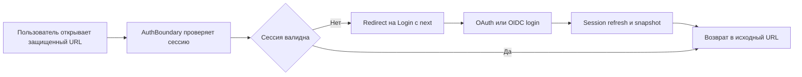

```text
+------------------------------------------------------+
| Login                                                 |
| next=/reviews/123                                     |
| [ Continue with GitHub ] [ Continue with GitLab ]     |
| status: 401 -> show message                           |
+------------------------------------------------------+
            |
            v
+------------------------------------------------------+
| App Shell -> Target Page (/reviews/123)              |
+------------------------------------------------------+
```

## Сценарий S02 — Онбординг репозитория и восстановление после ошибки скана

- Цель: подключить репозиторий, пройти скан, обработать ошибку и завершить onboarding.
- Экраны: Onboarding Wizard, Scan Progress, Scan Error Recovery, Repository Overview.
- Референсы: `WEB-ONBRD-001..007`.

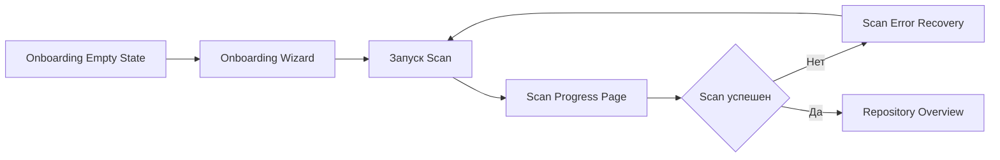

```text
+---------------- Onboarding Wizard -------------------+
| Step 1 Provider | Step 2 Repo | Step 3 Confirm         |
| [Connect] [Select repo] [Start scan]                |
+------------------------------------------------------+

+---------------- Scan Progress -----------------------+
| [#####-----] 52%  indexing files                      |
| events: parser, graph, metrics                        |
| [Retry] [Cancel]                                      |
+------------------------------------------------------+
```

## Сценарий S03 — Ежедневный мониторинг через Dashboard

- Цель: быстро понять состояние системы и перейти в проблемные области.
- Экраны: Dashboard, Activity Timeline, Metrics Cards.
- Референсы: `WEB-PAGE-001`, `WEB-DASH-001..006`, `WEB-COMP-001..004`.

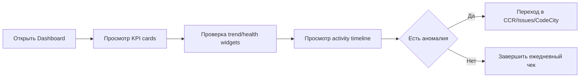

```text
+---------------------- Dashboard ---------------------+
| KPI Cards: Deploy freq | Cycle time | Bug ratio       |
| Trend chart | Token usage | Architecture health        |
| Activity timeline (today, yesterday, week)           |
| [Open CCR] [Open Issues] [Open CodeCity]             |
+------------------------------------------------------+
```

### Карта Dashboard (Mission Control)

- Принцип: dashboard = центр управления, а не "страница с графиками".
- Контекст: tenant (org) всегда явен; доп. скоуп (repo/team) и период задают все запросы/виджеты.
- Детерминизм: каждый блок имеет loading/empty/error состояние и ведёт deep-link в целевой экран.

```mermaid
flowchart TB
    subgraph DASH["Dashboard Mission Control"]
        S["Scope bar: Org/Repo/Team + Date Range"];
        K["KPI strip: cycle time, deploy freq, bug ratio, cost"];
        W["Work Queue: CCRs, Issues, Inbox"];
        SIG["Signals: Drift, Predictions, Architecture Health"];
        EXP["Explore: CodeCity, Graph, Causal, Impact, Refactor, Knowledge, Reports"];
        OPS["Ops: Jobs, Provider Health, Degraded Mode"];
        U["Usage & Plan: token usage, entitlement state"];
        QA["Quick Actions: scan, review, report, dry-run"];
    end

    W -->|"Open CCR list"| CCR["CCR Management"];
    W -->|"Open Review"| RV["Review Diff Workspace"];
    W -->|"Open Issues"| ISS["Issues Tracking"];
    W -->|"Open Inbox"| N["Notification Center"];

    SIG -->|"Open CodeCity"| CITY["CodeCity 2D/3D"];
    SIG -->|"Open Drift"| DR["Drift Detection Workspace"];
    SIG -->|"Open Predictions"| PR["Prediction Workspace"];

    EXP -->|"Open Graph"| GR["Graph Explorer"];
    EXP -->|"Open Causal"| CAUS["Causal Analysis Workspace"];
    EXP -->|"Open Impact"| IMP["Impact Planning Workspace"];
    EXP -->|"Open Refactor"| RF["Refactoring Planner"];
    EXP -->|"Open Knowledge"| KNOW["Knowledge Map Workspace"];
    EXP -->|"Open Reports"| REP["Reporting Workspace"];

    OPS -->|"Open Jobs"| JOB["Job Operations Center"];
    OPS -->|"Provider outage details"| OUT["Provider Degradation Console"];
    OPS -->|"Open Provider Settings"| SET["Settings: Providers"];

    U -->|"Open Usage"| USG["Token Usage"];
    U -->|"Open Billing"| BILL["Billing Lifecycle Console"];

    QA -->|"Run Dry Run"| DRY["Dry Run Results"];
    QA -->|"Generate report"| REP["Reporting Workspace"];

```

```text
+--------------------------------------------------------------+
| Org Switcher | Repo/Team | Date Range | Cmd+K | Theme | User |
+--------------------------------------------------------------+
| KPI strip: deploy freq | cycle time | bug ratio | cost       |
+---------------------+--------------------+-------------------+
| Work Queue           | Signals            | Ops & Governance   |
| - My CCRs (N)        | - Drift score      | - Jobs stuck (N)   |
| - High issues (N)    | - Predictions      | - Provider health  |
| - Inbox unread (N)   | - CodeCity snapshot| - Degraded banner  |
|                      | - Explore links     |                    |
|                      |   CodeCity/Graph/...|                    |
| [Open Reviews]       | [Open Explore]     | [Open Ops Center]  |
+---------------------+--------------------+-------------------+
| Usage & Plan: tokens today | budget | trial days | [Billing]   |
+--------------------------------------------------------------+
```

## Сценарий S04 — Ревью CCR: список -> diff -> обсуждение -> финал

- Цель: провести ревью изменения end-to-end.
- Экраны: CCR Management, Review Diff Workspace, Comment Thread.
- Референсы: `WEB-PAGE-002`, `WEB-COMP-005`, `WEB-COMP-006`, `WEB-COMP-007`, `WEB-RVCTX-001..005`.

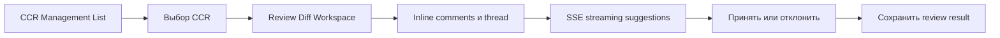

```text
+-------------------- CCR Management ------------------+
| Filters: repo/team/status | Virtualized list          |
| CCR #841 [Open Review]                              |
+------------------------------------------------------+

+------------------- Review Workspace -----------------+
| Left: file tree | Center: diff | Right: context/sidebar |
| Inline thread [resolve] [reply]                      |
| Streaming suggestions panel                           |
+------------------------------------------------------+
```

## Сценарий S05 — Контекстный AI-чат по CCR и коду

- Цель: получить AI-помощь с учетом конкретного CCR и файлов.
- Экраны: Chat Panel, Thread List, Context Indicator.
- Референсы: `WEB-CHAT-001..008`.

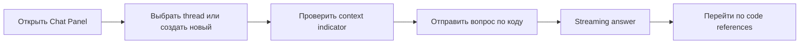

```text
+---------------------- Chat Panel --------------------+
| Threads | Active Chat                                |
| Context: repo-x / CCR-841 / file:a.ts                |
| Q: "почему этот риск высокий?"                        |
| A(stream): ... [code refs] [copy]                    |
+------------------------------------------------------+
```

## Сценарий S06 — Персонализация темы (HeroUI-like)

- Цель: пользователь настраивает тему под себя без перезагрузки.
- Экраны: Global Theme Switcher, Appearance Settings, Theme Library.
- Референсы: `WEB-DS-005..007`, `WEB-THEME-001..004`.

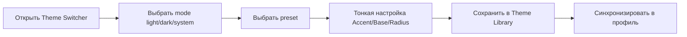

```text
+---------------- Appearance Settings -----------------+
| Mode: (light) (dark) (system)                        |
| Presets: Default Sky Lavender Mint ...               |
| Accent slider | Base palette | Radius (global/form)  |
| [Random] [Undo] [Save as My Theme] [Reset]           |
+------------------------------------------------------+
```

## Сценарий S07 — Настройка провайдеров и governance

- Цель: админ настраивает интеграции, безопасность и орг-параметры.
- Экраны: Git/LLM/BYOK/SAML/Integrations/Webhooks/Org/Team/Audit.
- Референсы: `WEB-PAGE-003..015`, `WEB-PAGE-021..024`.

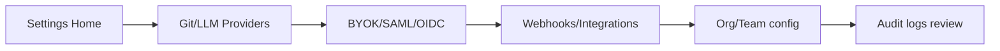

```text
+--------------------- Settings -----------------------+
| Sidebar: Providers / Security / Integrations / Team  |
| Main: form + test connection + save                  |
| Footer: audit trail link                              |
+------------------------------------------------------+
```

## Сценарий S08 — Управление правилами и dry-run перед включением

- Цель: безопасно вводить и тестировать правила анализа.
- Экраны: Rules Library, Rule Editor, Dry Run Results.
- Референсы: `WEB-PAGE-012`, `WEB-COMP-008`, `WEB-PAGE-020`, `WEB-COMP-013`.

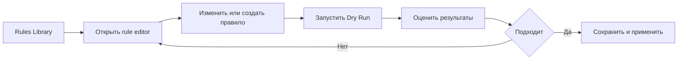

```text
+--------------------- Rule Editor --------------------+
| Rule name | Severity | Scope                           |
| TipTap/markdown/code blocks                           |
| [Run Dry] [Save Draft] [Publish]                      |
+------------------------------------------------------+

+------------------- Dry Run Results ------------------+
| Matched files | Violations | Suggested fixes             |
| [Apply rule] [Back to edit]                           |
+------------------------------------------------------+
```

## Сценарий S09 — Исследование CodeCity 2D и dependency graph

- Цель: понять структуру кодовой базы и impact текущих изменений.
- Экраны: CodeCity 2D, Graph Explorer, Node Details.
- Референсы: `WEB-CITY-001..008`, `WEB-GRAPH-001..009`.

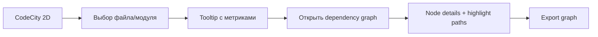

```text
+---------------------- CodeCity 2D -------------------+
| Treemap with metric colors and overlays               |
| Hover: complexity/churn/coverage tooltip              |
| Click: drill-down -> open graph panel                 |
+------------------------------------------------------+
```

## Сценарий S10 — CodeCity 3D + guided onboarding tour

- Цель: новый разработчик быстро изучает архитектуру через guided tour.
- Экраны: CodeCity 3D, Guided Tour Overlay, Project Overview Panel.
- Референсы: `WEB-CITY3-001..010`, `WEB-TOUR-001..006`.

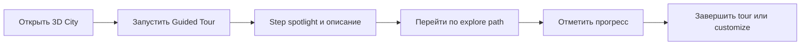

```text
+---------------------- CodeCity 3D -------------------+
| 3D city scene + camera presets                        |
| Tour overlay: Step 2/8 [Next] [Prev] [Skip]          |
| Side panel: architecture summary                       |
+------------------------------------------------------+
```

## Сценарий S11 — Причинный анализ и поиск root cause

- Цель: найти, почему деградирует качество, и увидеть цепочку причин.
- Экраны: Causal Workspace (2D/3D overlays), Chain Viewer.
- Референсы: `WEB-CAUSAL-001..006`, `WEB-CAUS3D-001..005`.

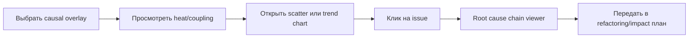

```text
+------------------- Causal Workspace -----------------+
| Overlay selector: temporal | bug heat | health        |
| Scatter churn vs complexity                          |
| Root Cause Chain (tree/DAG)                          |
+------------------------------------------------------+
```

## Сценарий S12 — Планирование рефакторинга по ROI

- Цель: выбрать рефакторинг-задачи с максимальной пользой.
- Экраны: Refactoring Dashboard, ROI Calculator, Timeline.
- Референсы: `WEB-REFAC-001..006`.

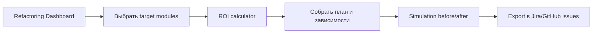

```text
+---------------- Refactoring Planner -----------------+
| Targets table: risk effort ROI                        |
| ROI sliders: effort/risk weights                      |
| Timeline (Gantt-like)                                 |
| [Simulate] [Export Tickets]                           |
+------------------------------------------------------+
```

## Сценарий S13 — Impact analysis (what-if)

- Цель: оценить blast radius до внесения изменений.
- Экраны: Impact Analysis Panel, Impact Graph, Risk Gauge.
- Референсы: `WEB-IMPACT-001..005`.

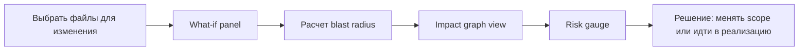

```text
+------------------ Impact Analysis -------------------+
| File selector + affected consumers/tests              |
| Risk gauge: green/yellow/red                          |
| Graph propagation view                                |
+------------------------------------------------------+
```

## Сценарий S14 — Knowledge map и bus factor

- Цель: понять ownership риски и knowledge silos.
- Экраны: Ownership/Bus Factor overlays, Contributor Graph, Silo Panel.
- Референсы: `WEB-KNOW-001..007`.

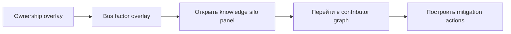

```text
+------------------- Knowledge Map --------------------+
| Overlay: owner colors / bus factor risk               |
| Silo panel: high-risk modules                          |
| Contributor graph: collaboration edges                 |
+------------------------------------------------------+
```

## Сценарий S15 — Drift detection и reporting

- Цель: обнаружить архитектурный дрейф и сформировать управленческий отчет.
- Экраны: Blueprint Editor, Drift Report, Report Generator/Viewer/List.
- Референсы: `WEB-DRIFT-001..007`, `WEB-REPORT-001..006`.

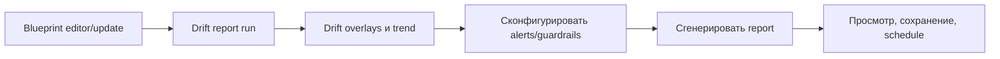

```text
+------------------ Drift & Reports -------------------+
| Blueprint editor (YAML + preview)                     |
| Drift report: violations + trend + city overlay       |
| Report generator: template + AI summary + schedule    |
+------------------------------------------------------+
```

## Сценарий S16 — Уведомления и triage событий

- Цель: не пропустить критичные события и быстро перейти в контекст проблемы.
- Экраны: Notification Center, Dashboard, Review/Drift/Prediction screens.
- Референсы: `WEB-NOTIF-001`.

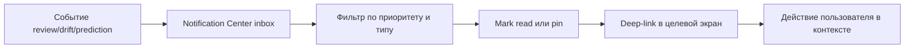

```text
+---------------- Notification Center -----------------+
| Filters: unread, critical, drift, review             |
| [Critical] Drift alert in module payments            |
| [Open Context] [Mark Read] [Mute Similar]            |
| Channel prefs: In-app / Slack / Discord / Teams      |
+------------------------------------------------------+
```

## Сценарий S17 — Объяснение решений SafeGuard

- Цель: повысить доверие к AI-замечаниям через прозрачность фильтров.
- Экраны: Review Diff Workspace + SafeGuard Explain Panel.
- Референсы: `WEB-SAFE-001`.

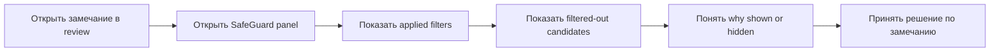

```text
+--------------- SafeGuard Decision Trace --------------+
| Issue #42: \"possible race condition\"                 |
| Filters: dedup=pass, hallucination=pass, severity=pass|
| Related hidden candidates: 3 (duplicate)              |
| Reason: similarity 0.96, lower evidence               |
+------------------------------------------------------+
```

## Сценарий S18 — Фидбек ревьюера и обучение системы

- Цель: замкнуть цикл Continuous Learning в понятный UX.
- Экраны: Review Workspace, Feedback Learning Console.
- Референсы: `WEB-FDBK-001`.

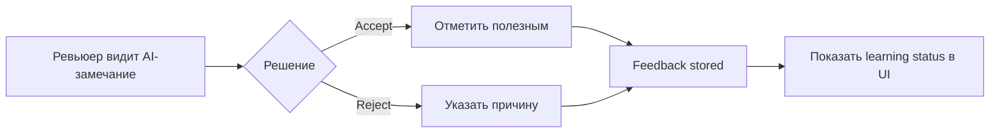

```text
+---------------- Feedback Panel ----------------------+
| Issue: \"Null check missing\"                         |
| [Accept] [Reject]                                     |
| Reject reason: (false positive) (duplicate) (irrelevant) |
| Status: \"Учтено в модели правил\"                     |
+------------------------------------------------------+
```

## Сценарий S19 — Переключение организации без утечки контекста

- Цель: безопасно работать в multi-tenant режиме.
- Экраны: Organization Switcher, App Shell, tenant-aware pages.
- Референсы: `WEB-TEN-001`.

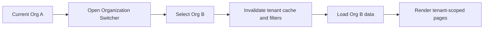

```text
+---------------- Organization Switcher ---------------+
| Current: Org A                                       |
| [Org B] [Org C]                                      |
| Confirm: \"Switch context and reset filters?\"        |
| Result: only Org B datasets in UI                     |
+------------------------------------------------------+
```

## Сценарий S20 — Роли, доступ и предсказуемая навигация

- Цель: пользователь всегда понимает, какие действия ему доступны и почему.
- Экраны: App navigation, RBAC states, guarded routes.
- Референсы: `WEB-RBAC-001`, `WEB-NAV-001`.

```mermaid
flowchart LR
    A["User opens menu"] --> B["Build IA by role and tenant"];
    B --> C["Hide or disable restricted entries"];
    C --> D["Route guard check on navigation"];
    D --> E{"Has access"};
    E -- "No" --> F["Show access reason and fallback"];
    E -- "Yes" --> G["Open target page"];

```

```text
+---------------- App Navigation ----------------------+
| Sections: Dashboard, Reviews, Settings, Reports       |
| MCP Admin (disabled) [Admin only]                     |
| Tooltip: \"Требуется роль Organization Admin\"         |
| Guard fallback: /access-denied with next-action       |
+------------------------------------------------------+
```

## Сценарий S21 — Billing lifecycle и entitlement

- Цель: корректно вести пользователя через trial, платежные состояния и ограничения фич.
- Экраны: Organization Settings, Billing Lifecycle Console.
- Референсы: `WEB-BILL-001`.

```mermaid
flowchart LR
    A["Trial started"] --> B["Track usage and expiry"];
    B --> C{"Payment status"};
    C -- "Active" --> D["Full features"];
    C -- Past-due --> E["Soft lock + payment CTA"];
    C -- "Canceled" --> F["Downgrade and feature lock"];
    D --> G["Billing history"];
    E --> G;
    F --> G;

```

```text
+---------------- Billing & Entitlements --------------+
| Plan: Pro (trial day 5/14)                            |
| Status: past-due                                      |
| Locked: 3D CodeCity, predictive alerts                |
| [Update Payment] [Downgrade] [View History]           |
+------------------------------------------------------+
```

## Сценарий S22 — Мониторинг и восстановление долгих задач

- Цель: оператор видит состояние review/scan/analytics jobs и может безопасно восстановить пайплайн.
- Экраны: Job Operations Center, related deep-link screens.
- Референсы: `WEB-JOB-001`.

```mermaid
flowchart LR
    A["Open Job Operations Center"] --> B["Filter by type and status"];
    B --> C["Inspect failed or stuck job"];
    C --> D["Open error details and attempts"];
    D --> E{"Operator action"};
    E -- "Retry" --> F["Requeue job"];
    E -- "Cancel" --> G["Mark canceled"];
    E -- "Escalate" --> H["Create incident link"];
    F --> I["Track new run state"];
    G --> I;
    H --> I;

```

```text
+---------------- Job Operations Center ---------------+
| Job #R-182 review-worker | status: stuck | ETA: --    |
| Attempts: 3 | last error: rate-limit provider         |
| [Retry] [Requeue] [Cancel] [Open Logs]               |
| Audit: who triggered action and when                  |
+------------------------------------------------------+
```

## Сценарий S23 — Истечение сессии без потери черновика

- Цель: пользователь продолжает работу после forced re-auth и не теряет введенные данные.
- Экраны: Session Recovery Flow, App Shell, forms in Settings/Review.
- Референсы: `WEB-SESSION-001`.

```mermaid
flowchart LR
    A["Пользователь редактирует форму или review comment"] --> B["Сессия истекает"];
    B --> C["Save action returns 401"];
    C --> D["Autosave draft в local/session storage"];
    D --> E["Показ forced re-auth modal"];
    E --> F["Успешный login/refresh"];
    F --> G["Restore draft and pending intent"];
    G --> H["Повторная отправка действия"];

```

```text
+---------------- Session Expired ---------------------+
| Your session has expired.                            |
| Draft saved at 12:41:09                              |
| [Re-authenticate] [Discard Draft]                    |
+------------------------------------------------------+
```

## Сценарий S24 — Конкурентное редактирование конфигов

- Цель: исключить silent overwrite при параллельной работе админов.
- Экраны: Concurrent Edit Resolver, Settings forms (rules/providers/billing).
- Референсы: `WEB-CONCUR-001`.

```mermaid
flowchart LR
    A["Admin A opens config v12"] --> B["Admin B opens config v12"];
    B --> C["Admin A saves v13"];
    C --> D["Admin B tries save v12"];
    D --> E["Conflict detected by version mismatch"];
    E --> F["Show diff and merge options"];
    F --> G["Merge or reload latest"];
    G --> H["Audit conflict resolution"];

```

```text
+---------------- Config Conflict ---------------------+
| Remote version: v13 | Your version: v12              |
| Changed fields: model, timeout, fallback policy      |
| [Review Diff] [Merge Changes] [Reload Latest]        |
+------------------------------------------------------+
```

## Сценарий S25 — Изменение прав в середине сессии (policy drift)

- Цель: права доступа меняются предсказуемо и безопасно без хаотичных ошибок.
- Экраны: Runtime Policy Drift Guard, RBAC Policy States, guarded routes.
- Референсы: `WEB-POLICY-001`, `WEB-RBAC-001`, `WEB-NAV-001`.

```mermaid
flowchart LR
    A["Пользователь работает на странице"] --> B["Role or entitlement changed on backend"];
    B --> C["UI получает policy version update"];
    C --> D["Invalidate permissions cache"];
    D --> E["Re-evaluate доступные actions/routes"];
    E --> F["Disable restricted actions with reason"];
    F --> G["Offer safe refresh or fallback route"];

```

```text
+---------------- Access Policy Updated ---------------+
| Your access was updated by organization admin.        |
| Some actions are now unavailable in this context.     |
| [Refresh Permissions] [Go to Allowed Area]            |
+------------------------------------------------------+
```

## Сценарий S26 — Безопасный deep-link с tenant/role guard

- Цель: исключить утечки контекста и неверные переходы по внешним ссылкам.
- Экраны: Deep-link Guard Screen, Organization Switcher, access fallback page.
- Референсы: `WEB-LINK-001`, `WEB-TEN-001`, `WEB-RBAC-001`.

```mermaid
flowchart LR
    A["Open deep-link from notification or Slack"] --> B["Validate tenant and role"];
    B --> C{"Allowed in current org"};
    C -- "No" --> D["Prompt org switch or deny access"];
    C -- "Yes" --> E["Validate and sanitize query params"];
    E --> F["Open target screen"];
    D --> G["Safe fallback route"];

```

```text
+---------------- Deep-link Guard ---------------------+
| Link points to Org B, current context is Org A.      |
| [Switch to Org B] [Stay in Org A]                    |
| Unsafe params removed: debug=true, rawToken=...      |
+------------------------------------------------------+
```

## Сценарий S27 — Режим деградации провайдеров

- Цель: платформа остается управляемой при частичном отказе внешних сервисов.
- Экраны: Provider Degradation Console, Dashboard, Job Operations Center.
- Референсы: `WEB-OUTAGE-001`, `WEB-JOB-001`, `WEB-NOTIF-001`.

```mermaid
flowchart LR
    A["Provider health drops below threshold"] --> B["Show global degraded banner"];
    B --> C["Mark affected actions as delayed or queued"];
    C --> D["Route user to degradation console"];
    D --> E["Offer retry window and runbook actions"];
    E --> F["Track recovery state"];

```

```text
+--------------- Provider Degraded Mode ---------------+
| LLM Provider: partial outage (rate limit spike)      |
| Affected: live review suggestions, chat streaming    |
| [Queue Requests] [Retry in 2m] [Open Runbook]        |
+------------------------------------------------------+
```

## Сценарий S28 — Массовые действия с undo и audit

- Цель: ускорить операционные действия без риска необратимых ошибок.
- Экраны: Bulk Action Command Bar, Notification Center, Issues/Reviews lists.
- Референсы: `WEB-BULK-001`, `WEB-NOTIF-001`.

```mermaid
flowchart LR
    A["Select multiple rows"] --> B["Choose batch action"];
    B --> C["Optimistic UI update"];
    C --> D["Show undo snackbar with timer"];
    D --> E{"Undo clicked"};
    E -- "Yes" --> F["Rollback local and server state"];
    E -- "No" --> G["Commit action"];
    G --> H["Write audit event"];

```

```text
+---------------- Bulk Actions ------------------------+
| Selected: 24 alerts                                  |
| Action: Mark as read                                 |
| [Apply] [Cancel]                                     |
| Snackbar: Applied to 24 items [Undo 10s]             |
+------------------------------------------------------+
```

## Сценарий S29 — Контракты import/export и versioning

- Цель: импорт данных (themes/rules) безопасен и предсказуем между версиями UI.
- Экраны: Data Contract Validator, User Theme Library, Rules Library.
- Референсы: `WEB-CONTRACT-001`, `WEB-THEME-004`, `WEB-PAGE-012`.

```mermaid
flowchart LR
    A["User uploads JSON file"] --> B["Parse and validate schema"];
    B --> C{"Version compatible"};
    C -- "Yes" --> D["Show preview and apply"];
    C -- "No" --> E["Try migration rule"];
    E --> F{"Migration success"};
    F -- "Yes" --> D;
    F -- "No" --> G["Show actionable error and block import"];

```

```text
+--------------- Import Contract Check ---------------+
| File: team-themes.json                               |
| Schema: v1, App supports: v2                         |
| Migration: available (v1 -> v2)                      |
| [Preview Migrated Data] [Apply] [Cancel]             |
+------------------------------------------------------+
```

## Сценарий S30 — Privacy-safe export и redaction

- Цель: не допускать утечек секретов/PII при копировании и экспорте данных.
- Экраны: Safe Export Redaction Panel, Reporting Workspace, Chat/Review copy actions.
- Референсы: `WEB-PRIV-001`, `WEB-REPORT-001..006`, `WEB-CHAT-001..008`.

```mermaid
flowchart LR
    A["User starts export or copy action"] --> B["Run client-side sensitive data scan"];
    B --> C["Detect secrets or PII markers"];
    C --> D["Suggest redaction replacements"];
    D --> E{"User confirms redacted output"};
    E -- "Yes" --> F["Export/share redacted content"];
    E -- "No" --> G["Cancel or edit manually"];

```

```text
+------------- Sensitive Data Redaction ---------------+
| Detected: API key, email, webhook secret             |
| Suggested replacements: [REDACTED_KEY], [EMAIL]      |
| [Apply Redaction] [Edit Manually] [Cancel Export]    |
+------------------------------------------------------+
```

## Сценарий S31 — Multi-tab consistency для tenant/theme/permissions

- Цель: состояние пользователя остается консистентным во всех открытых вкладках.
- Экраны: App Shell, Organization Switcher, Global Theme Switcher, guarded routes.
- Референсы: `WEB-MTAB-001`, `WEB-TEN-001`, `WEB-RBAC-001`, `WEB-DS-006`.

```mermaid
flowchart LR
    A["Tab A changes tenant/theme/role snapshot"] --> B["BroadcastChannel or storage event"];
    B --> C["Tab B receives state update"];
    C --> D["Revalidate permissions and route guards"];
    D --> E["Invalidate stale caches by tenant"];
    E --> F["Apply theme and UI policy changes"];
    F --> G["Show non-blocking sync notice"];

```

```text
+--------------- Cross-tab Sync Notice ----------------+
| Context updated from another tab.                    |
| Tenant: Org B | Theme: Mint | Access: Developer      |
| [Refresh Now] [Keep Working]                         |
+------------------------------------------------------+
```

## Сценарий S32 — Системный e2e regression suite для a11y/i18n

- Цель: предотвращать регрессии доступности и локализации на критичных пользовательских маршрутах.
- Экраны: Accessibility & Localization Regression Lab, ключевые route-level страницы.
- Референсы: `WEB-E2E-001`, `WEB-FOUND-004`.

```mermaid
flowchart LR
    A["PR or nightly pipeline starts"] --> B["Run critical user journeys"];
    B --> C["Execute keyboard-only navigation checks"];
    C --> D["Assert ARIA roles, names, landmarks"];
    D --> E["Run long-locale and pseudo-locale snapshots"];
    E --> F["Screen reader flow assertions"];
    F --> G{"Regression detected"};
    G -- "Yes" --> H["Block merge and attach diagnostics"];
    G -- "No" --> I["Publish quality report"];

```

```text
+----------- A11y/I18n Regression Matrix --------------+
| Routes: /dashboard /reviews/:id /settings/appearance |
| Locales: en, ru, pseudo-long                          |
| Checks: tab order, focus visible, aria labels         |
| Screen reader: landmarks/headings/action names        |
| Result: PASS 42 / FAIL 0                              |
+------------------------------------------------------+
```

## Сценарий S33 — Activation checklist: onboarding до first value

- Цель: довести новый org от пустого состояния до первого измеримого результата без ручного сопровождения.
- Экраны: Dashboard, Activation Checklist, Settings (Providers/SSO/Notifications), Onboarding Wizard, Scan Progress.
- Референсы: `WEB-ACT-001`.

```mermaid
flowchart LR
    A["Пользователь впервые заходит в org"] --> B["Dashboard показывает Activation Checklist"];
    B --> C["Выбор следующего шага"];
    C --> D["Deep-link в нужный экран"];
    D --> E["Выполнить шаг: connect/invite/scan/config"];
    E --> F["Checklist обновляет прогресс и blockers"];
    F --> G{"First value достигнут"};
    G -- "Нет" --> C;
    G -- "Да" --> H["Показать next-best actions + закрепить “My Work”"];

```

```text
+-------------------- Dashboard -----------------------+
| Activation Checklist  3/8  [View all]                |
|  [x] Connect Git provider                            |
|  [ ] Connect LLM provider   (blocked: missing BYOK)  |
|  [ ] Invite teammates                                |
|  [ ] Add repository                                  |
|  [ ] Run first scan     [Start]                      |
|  [ ] Configure notifications                          |
|  [ ] Baseline rules + Dry Run                        |
|  Progress: 38%                                       |
+------------------------------------------------------+
```

## Сценарий S34 — Единый My Work / Triage: ежедневная очередь

- Цель: пользователь открывает одну страницу и закрывает ежедневный triage (что горит, что у меня).
- Экраны: My Work / Triage, Notification Center, CCR Management, Issues Tracking, Job Operations Center.
- Референсы: `WEB-INBOX-001`.

```mermaid
flowchart LR
    A["Открыть My Work"] --> B["Сформировать очередь по приоритету"];
    B --> C["Фильтр: mine/team/repo"];
    C --> D["Открыть элемент в контексте"];
    D --> E["Выполнить действие: review/assign/snooze/retry"];
    E --> F["Элемент обновляет статус в очереди"];
    F --> G{"Очередь пустая"};
    G -- "Нет" --> D;
    G -- "Да" --> H["Показать “All clear” + suggested actions"];

```

```text
+--------------------- My Work ------------------------+
| Filters: [Mine] [Team] [Critical] [Today]            |
| Queue                                                |
|  1) CCR #841 needs review      [Open] [Assign]       |
|  2) Issue spike: Sev-1 (5)     [Open] [Mute]         |
|  3) Job stuck: repo scan       [Open Ops] [Retry]    |
|  4) Inbox: Drift alert         [Open] [Snooze]       |
+------------------------------------------------------+
```

## Сценарий S35 — Enterprise таблицы: кастомизация, saved views, экспорт

- Цель: списки остаются удобными на больших данных и поддерживают workflow конкретной роли.
- Экраны: CCR Management, Issues Tracking, Audit Logs, Token Usage (все с DataTable kit).
- Референсы: `WEB-TBL-001`.

```mermaid
flowchart LR
    A["Открыть list-страницу"] --> B["Настроить таблицу: колонки/плотность"];
    B --> C["Фильтры + сортировка"];
    C --> D["Сохранить view"];
    D --> E["Навигация и действия клавиатурой"];
    E --> F["Экспорт данных или share view link"];

```

```text
+------------------ Issues Tracking -------------------+
| View: “Sev1 Ops” [Save] [Share]                      |
| Columns [x] Title [x] Sev [ ] Owner [x] Status       |
| Density: (Compact)  Search: [........]  Export [CSV] |
| ---------------------------------------------------- |
| Sev1 | payments timeout | Open | Owner: Team A       |
| Sev2 | flaky tests      | Triaged | Owner: Me        |
+------------------------------------------------------+
```

## Сценарий S36 — Доверие к данным: freshness и provenance

- Цель: пользователь понимает актуальность и происхождение метрик, не принимает решения на stale данных.
- Экраны: Dashboard, Provenance Drawer, Scan Progress Page, Job Operations Center.
- Референсы: `WEB-FRESH-001`.

```mermaid
flowchart LR
    A["Пользователь видит метрику/сигнал"] --> B["Индикатор freshness: updated/stale/partial"];
    B --> C{"Данные stale или partial"};
    C -- "Нет" --> D["Продолжить работу"];
    C -- "Да" --> E["Открыть Provenance drawer"];
    E --> F["Понять источник: scan/job/commit/window"];
    F --> G["Запустить refresh/rescan или открыть job details"];
    G --> H["Данные обновлены -> UI снимает stale"];

```

```text
+---------------------- Dashboard ---------------------+
| Architecture Health: 72  (stale: updated 8h ago)     |
| [Why?] [Provenance] [Refresh]                        |
| Provenance: scan #1842, commit abc123, window 7d     |
+------------------------------------------------------+
```

## Сценарий S37 — Timezone-aware scheduling: preview next runs

- Цель: расписания (rescan/reports) понятны в международных командах и не ломаются на DST.
- Экраны: Rescan Schedule Dialog, Reporting Workspace (schedule), Timezone & Schedule Preview.
- Референсы: `WEB-TZ-001`.

```mermaid
flowchart LR
    A["Открыть schedule dialog"] --> B["Выбрать timezone"];
    B --> C["Настроить cadence/cron-like правила"];
    C --> D["Посмотреть preview следующих запусков"];
    D --> E{"Похоже на ожидания"};
    E -- "Нет" --> C;
    E -- "Да" --> F["Сохранить schedule"];
    F --> G["UI показывает next run везде консистентно"];

```

```text
+---------------- Rescan Schedule ---------------------+
| Timezone: (Asia/Tashkent) [Change]                   |
| Cadence: Every weekday at 09:00                      |
| Next runs:                                           |
|  - Wed 2026-03-04 09:00                              |
|  - Thu 2026-03-05 09:00                              |
|  - Fri 2026-03-06 09:00                              |
| Note: DST applied automatically                      |
| [Save] [Cancel]                                      |
+------------------------------------------------------+
```

## Сценарий S38 — Explainability для скорингов и сигналов аналитики

- Цель: пользователь может объяснить “почему так” и принять решение без “магии” и споров в компании.
- Экраны: Prediction Workspace, Drift Detection Workspace, Explainability Drawer, Reporting Workspace.
- Референсы: `WEB-XAI-001`.

```mermaid
flowchart LR
    A["Пользователь видит риск/score"] --> B["Открыть Explain drawer"];
    B --> C["Top factors + thresholds + confidence"];
    C --> D["Перейти в источники/срезы данных"];
    D --> E["Сформировать action: plan/refactor/report"];
    E --> F["Экспорт объяснения в отчёт/сниппет"];

```

```text
+---------------- Explainability ----------------------+
| Drift Score: 0.78 (confidence 0.62)                  |
| Top factors:                                         |
|  - Temporal coupling +0.22                           |
|  - Churn 90d +0.18                                   |
|  - Ownership concentration +0.12                     |
| Data window: last 90 days                            |
| [Open Sources] [Export]                              |
+------------------------------------------------------+
```

## Сценарий S39 — Help & Diagnostics: self-serve troubleshooting

- Цель: пользователь сам находит причину проблемы и путь решения, не теряя время на саппорт.
- Экраны: Help & Diagnostics Center, Provider Degradation Console, Scan Error Recovery, Session Recovery Flow.
- Референсы: `WEB-HELP-001`.

```mermaid
flowchart LR
    A["Пользователь видит ошибку или деградацию"] --> B["CTA Open Help Diagnostics"];
    B --> C["Запустить диагностику"];
    C --> D["Результаты: auth network provider browser"];
    D --> E{"Есть автосценарий фикса"};
    E -- "Да" --> F["Пошаговый runbook и deep links"];
    E -- "Нет" --> G["Сформировать redacted support bundle"];
    F --> H["Проверить что проблема решена"];
    G --> H;

```

```text
+---------------- Diagnostics -------------------------+
| Auth: OK | Network: OK | Git: OK | LLM: Rate limited |
| Browser: WebGL enabled | Storage: OK                 |
| Suggested actions:                                   |
|  - Switch LLM provider fallback                       |
|  - Retry in 2m                                        |
| [Open Degradation Console] [Generate Support Bundle] |
+------------------------------------------------------+
```

## Сценарий S40 — Единые empty/error states и microcopy

- Цель: любые loading/empty/error/partial состояния предсказуемы и не блокируют пользователя.
- Экраны: Все route-level страницы, System Empty/Error States, Help & Diagnostics Center.
- Референсы: `WEB-STATE-001`.

```mermaid
flowchart LR
    A["Открыть страницу"] --> B["Fetch данных"];
    B --> C{"Ответ успешен"};
    C -- "Нет" --> D["Error state: причина + retry + diagnostics link"];
    C -- "Да" --> E{"Данные пустые"};
    E -- "Да" --> F["Empty state: объяснение + primary CTA"];
    E -- "Нет" --> G["Render content"];
    D --> B;
    F --> H["CTA ведёт в onboarding/filters/action"];

```

```text
+------------------- Empty State ----------------------+
| No repositories yet                                  |
| Start by connecting a repo to see insights.          |
| [Start Onboarding] [Learn More]                      |
+------------------------------------------------------+
```

## Сценарий S41 — Workspace personalization: scope, pins, views

- Цель: пользователь настраивает продукт под свой workflow (без повторения одинаковых кликов каждый день).
- Экраны: Workspace Personalization, Dashboard, My Work, DataTable views.
- Референсы: `WEB-PERS-001`.

```mermaid
flowchart LR
    A["Открыть personalization"] --> B["Выбрать default scope"];
    B --> C["Настроить pins/widgets"];
    C --> D["Сохранить saved views"];
    D --> E["Share view link или sync в профиль"];
    E --> F["UI применяет настройки при следующем входе"];

```

```text
+-------------- Workspace Personalization --------------+
| Default: Org A / Repo payments / Team Platform       |
| Pins: [My Work] [Issues] [Ops] [Explore Graph]       |
| Saved Views: “Sev1 Ops”, “My CCRs”, “Cost Watch”     |
| [Save] [Share] [Reset]                               |
+------------------------------------------------------+
```

## Сценарий S42 — Global Search & Command Palette (Cmd+K)

- Цель: сохранить discoverability при сложной IA и ускорить навигацию/действия для power users.
- Экраны: Command Palette, Keyboard Cheatsheet, ключевые страницы (deep-links).
- Референсы: `WEB-SRCH-004`, `WEB-KBD-001`, `WEB-KBD-002`.

```mermaid
flowchart LR
    A["Пользователь находится на любой странице"] --> B["Нажать Cmd+K / Ctrl+K"];
    B --> C["Открыть Command Palette"];
    C --> D["Ввести запрос или выбрать action"];
    D --> E{"Тип результата"};
    E -- "Entity" --> F["Перейти на страницу объекта"];
    E -- "Action" --> G["Выполнить действие (switch org, open diagnostics, start scan)"];
    F --> H["Закрыть palette и сохранить контекст"];
    G --> H;

```

```text
+------------------- Command Palette ------------------+
| Search…  (Cmd+K)                                     |
|------------------------------------------------------|
| CCRs                                                  |
|  - #1249 "payments: refactor"                         |
| Issues                                                |
|  - Sev1 "S3 bucket policy drift"                      |
| Actions                                               |
|  - Switch organization                                |
|  - Open Diagnostics                                   |
+------------------------------------------------------+
```

## Сценарий S43 — Triage Ownership: assigned/SLA/escalation

- Цель: My Work / Triage не превращается в “свалку”, каждый item имеет владельца и сроки.
- Экраны: My Work / Triage, Assignment UX (inline + dialog), Notifications (escalation).
- Референсы: `WEB-INBOX-001`, `WEB-INBOX-002`.

```mermaid
flowchart LR
    A["Открыть My Work"] --> B["Отфильтровать mine/team/repo"];
    B --> C["Сортировка по urgency/SLA"];
    C --> D{"Item без owner"};
    D -- "Да" --> E["Quick assign: self/team"];
    E --> F["Установить SLA/due-date"];
    D -- "Нет" --> G["Взять item в работу"];
    F --> H["Work on item -> done/blocked/snooze"];
    G --> H;
    H --> I["Escalation при риске просрочки"];

```

```text
+---------------------- My Work -----------------------+
| Priority | Item                  | Owner | SLA | ... |
| P0       | Scan failed (repo A)  |  —    | 2h  |Assign|
| P1       | CCR #1249 needs reply | me    | 1d  |Open  |
| P1       | Sev1 issue in auth    | team  | 4h  |Snooze|
+------------------------------------------------------+
```

## Сценарий S44 — Keyboard-first UX + shortcuts overlay

- Цель: быстрые операции без мыши, единые шорткаты и понятная справка.
- Экраны: Command Palette, Keyboard Cheatsheet, все ключевые списки/таблицы.
- Референсы: `WEB-KBD-001`, `WEB-KBD-002`, `WEB-SRCH-004`.

```mermaid
flowchart LR
    A["Пользователь работает клавиатурой"] --> B["Navigation shortcuts"];
    B --> C["Cmd+K: открыть palette"];
    B --> D["Shift+?: открыть cheatsheet"];
    D --> E["Найти нужную команду"];
    E --> F["Запустить shortcut"];
    C --> F;

```

```text
+----------------- Keyboard Shortcuts -----------------+
| Navigation:  g d (Dashboard)   g m (My Work)         |
| Search:       Cmd+K (Palette)  / (Focus search)      |
| Tables:       j/k move   enter open   x select row   |
| Graph:        +/- zoom   f focus   esc clear         |
| [Search shortcuts…]                                 |
+------------------------------------------------------+
```

## Сценарий S45 — Graph Explorer scale policy (clustering + progressive render)

- Цель: графы остаются полезными на enterprise-репозиториях без фризов и “white screens”.
- Экраны: Graph Explorer, Huge-graph fallback views.
- Референсы: `WEB-GRAPH-001..012`.

```mermaid
flowchart LR
    A["Открыть Graph Explorer"] --> B["Загрузить stats (nodes/edges)"];
    B --> C{"В пределах budget"};
    C -- "Да" --> D["Render full graph"];
    C -- "Нет" --> E["Предложить clustering/depth limits"];
    E --> F["Progressive render + lazy детализация"];
    F --> G{"Слишком большой даже с ограничениями"};
    G -- "Да" --> H["Fallback: paths/table/summary + export"];
    G -- "Нет" --> D;

```

```text
+-------------------- Graph Explorer ------------------+
| Depth: 3  | Cluster: ON | Nodes: 12,480 (budget 1k)  |
| [Apply limits] [Show paths] [Export]                 |
| Banner: Rendering aggregated view (expand clusters)  |
+------------------------------------------------------+
```

## Сценарий S46 — Chart scale policy (downsampling + aggregation transparency)

- Цель: dashboard и аналитические виджеты остаются быстрыми на длинных периодах.
- Экраны: Dashboard widgets, Token Usage, аналитические workspace.
- Референсы: `WEB-COMP-001`, `WEB-CHART-001`, `WEB-CHART-002`.

```mermaid
flowchart LR
    A["Открыть страницу с графиком"] --> B["Запрос данных"];
    B --> C{"Points > threshold"};
    C -- "Да" --> D["Server aggregation или client downsampling"];
    C -- "Нет" --> E["Render raw series"];
    D --> F["Render chart + badge 'aggregated'"];
    E --> F;
    F --> G["Экспорт raw данных при необходимости"];

```

```text
+-------------------- Token Usage ---------------------+
| Cost trend (last 90 days)  [Aggregated: 1d bins]     |
|  (chart)                                              |
| [Download raw CSV]                                   |
+------------------------------------------------------+
```

## Сценарий S47 — Bulk onboarding + templates (enterprise admin)

- Цель: админ подключает десятки репозиториев и применяет стандартные настройки без ручной рутины.
- Экраны: Bulk Onboarding, Onboarding Templates Registry, Scan Progress.
- Референсы: `WEB-ONBRD-008`, `WEB-ONBRD-009`, `WEB-ONBRD-002`.

```mermaid
flowchart LR
    A["Admin открывает Onboarding"] --> B["Выбрать провайдера"];
    B --> C["Import repo list"];
    C --> D["Multi-select repos"];
    D --> E["Выбрать template"];
    E --> F["Start scans (parallel)"];
    F --> G["Bulk progress page"];
    G --> H{"Есть failures"};
    H -- "Да" --> I["Retry per-repo / pause / cancel"];
    H -- "Нет" --> J["Repository Overview"];

```

```text
+-------------------- Bulk Onboarding -----------------+
| Template: "Platform Standard" [Preview]              |
| [ ] repo-auth     [scan] [schedule] [tags]           |
| [x] repo-payments  [scan] [schedule] [tags]          |
| [x] repo-core      [scan] [schedule] [tags]          |
| [Start scans] [Save as template]                     |
+------------------------------------------------------+
```

## Сценарий S48 — Usage & Adoption loop (UX telemetry -> улучшения)

- Цель: понимать, где пользователи “застревают”, и улучшать UX по данным (time-to-first-value, drop-offs).
- Экраны: Usage & Adoption Analytics, Activation Checklist, Help & Diagnostics.
- Референсы: `WEB-HOOK-007`, `WEB-PAGE-025`, `WEB-ACT-001`.

```mermaid
flowchart LR
    A["Пользователи выполняют ключевые действия"] --> B["useAnalytics пишет события"];
    B --> C["Backend агрегирует метрики"];
    C --> D["Admin открывает Usage & Adoption"];
    D --> E["Фаннел + drop-offs + time-to-first-value"];
    E --> F["Принять меры: improve onboarding/permissions/help"];
    F --> G["Повторно измерить"];

```

```text
+---------------- Usage & Adoption (Admin) ------------+
| Funnel: Connect -> Add repo -> First scan -> Insights |
| Drop-off: "SSO setup" 32%                             |
| Time to first value: median 18m                       |
| [Open Activation Checklist] [Open Diagnostics]         |
+------------------------------------------------------+
```

---

## 4. Оценка полноты планирования UI

- Сильные стороны текущего плана:
- Покрыты все ключевые пользовательские циклы: onboarding, review, chat, governance, аналитика, отчеты.
- Есть отдельные epic-ветки для 2D/3D визуализаций и продвинутой аналитики.
- Theme personalization (HeroUI-like) выделена в самостоятельный набор задач.
- Существенные gaps первого слоя (notifications, SafeGuard explainability, feedback loop, tenancy switch, RBAC/navigation, billing lifecycle, job operations) формализованы в `S16-S22` и задачах `WEB-NOTIF-001..WEB-JOB-001`.
- Существенные gaps второго слоя (session expiry recovery, concurrent admin edits, mid-session policy drift, secure deep-links, provider degraded mode, bulk actions safety, import/export contracts, privacy-safe exports) формализованы в `S23-S30` и задачах `WEB-SESSION-001..WEB-PRIV-001`.
- Существенный gap cross-tab consistency формализован в `S31` и задаче `WEB-MTAB-001`.
- Существенный quality gap e2e a11y/i18n для длинных локализаций и screen reader flow формализован в `S32` и задаче `WEB-E2E-001`.
- Существенные enterprise UX gaps (activation checklist, triage hub, enterprise tables, data freshness/provenance, timezone scheduling, explainability, help/diagnostics, system states, workspace personalization) формализованы в `S33-S41` и задачах `WEB-ACT-001..WEB-PERS-001`.
- Существенные gaps discoverability/операционного UX (Cmd+K command palette, keyboard-first, triage ownership/SLA, scale policies для графов/чартов, bulk onboarding + templates, usage/adoption loop) формализованы в `S42-S48` и задачах `WEB-SRCH-004`, `WEB-KBD-001..002`, `WEB-INBOX-002`, `WEB-GRAPH-010..012`, `WEB-CHART-001..002`, `WEB-ONBRD-008..009`, `WEB-HOOK-007`, `WEB-PAGE-025`.
- Остаточные риски:
- Нужны продуктовые определения и контракты: SLA semantics, escalation rules, и точные определения funnel-метрик (иначе adoption аналитика будет “спорной”).
- Требуются backend-агрегаты для масштабирования: chart aggregation и graph summaries (иначе UI будет вынужден резать данные слишком агрессивно).
- HeroUI v3 остаётся RC-зависимостью: компоненты тестируются через Vitest, чтобы выдерживать обновления.
- Единство терминологии и microcopy (ru/en) становится критичным при расширении функций: нужен governance для текста/лейблов, иначе UX деградирует в мелочах.

---

## 5. Что рекомендовано добавить следующим шагом

- `UI-ROUTES-MAP.md`: финальный список маршрутов и guard-правила после `WEB-NAV-001`.
- `UI-RBAC-MATRIX.md`: права по ролям для каждого экрана/действия после `WEB-RBAC-001`.
- `UI-DATA-CONTRACT-MAP.md`: какие API-контракты питают каждый экран.
- `UI-OPS-RUNBOOK.md`: стандартные действия оператора при stuck/failed jobs и provider outages.
- `UI-SESSION-RESILIENCE.md`: стратегии autosave, re-auth recovery, retry semantics.
- `UI-SECURITY-GUARDS.md`: deep-link validation, query sanitization, safe fallback policies.
- `UI-CROSS-TAB-SYNC.md`: стратегия синхронизации tenant/theme/permission state между вкладками.
- `UI-E2E-QUALITY-MATRIX.md`: матрица критичных маршрутов и checks для a11y/i18n regression suite.
- `UI-SHORTCUTS-MAP.md`: глобальные и page-scope шорткаты + конфликт-матрица после `WEB-KBD-001`.
- `UI-ADOPTION-METRICS.md`: определения funnel/time-to-first-value/drop-off метрик после `WEB-PAGE-025`.
